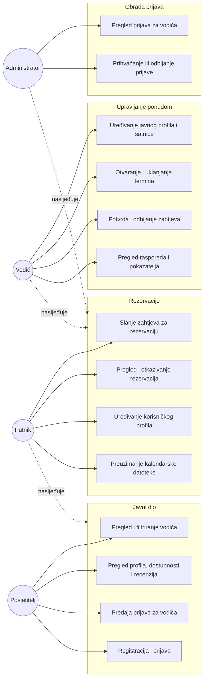
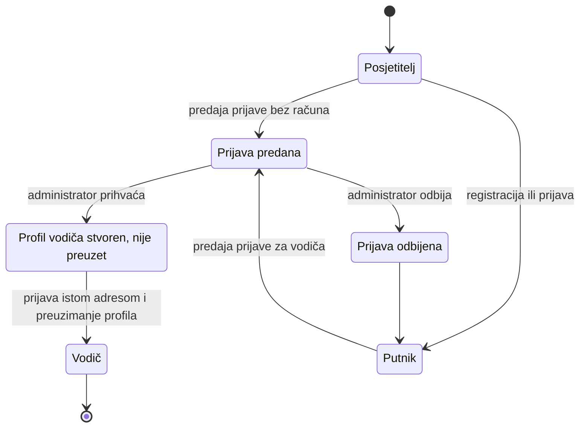

# 2. ANALIZA PODRUČJA I POSTOJEĆIH RJEŠENJA

Hrvatska je jedna od najposjećenijih turističkih destinacija u Europi, a znatan dio posjetitelja u nju se vraća više puta. Ipak, iskustva putnika pokazuju da se u većim gradovima ponuda namijenjena turistima iscrpi vrlo brzo. U Zagrebu, gradu s blizu 800 000 stanovnika, gotovo se sve atrakcije koje se redovito pojavljuju u vodičima i preporukama — Trg bana Josipa Jelačića, Gornji grad, Hrvatsko narodno kazalište, Markov trg i katedrala — mogu obići u svega nekoliko sati, najviše u dan ili dva. Nakon toga posjetitelj koji ostaje dulje ostaje i bez jasnog sljedećeg koraka.

Iz toga slijedi razlika između *turističkog* grada i stvarnoga grada koji poznaju njegovi stanovnici. Ta razlika nije posljedica nedostatka sadržaja, nego nedostatka posrednika: znanje o tome kamo se ide izvan središta, koji je kvart vrijedan šetnje, gdje se sluša glazba i gdje se jede ono što jedu lokalci nije zapisano u ponudi, već postoji kod ljudi. Postojeće platforme to znanje posreduju samo u mjeri u kojoj ga je moguće zapakirati u proizvod — u unaprijed definiranu turu s fiksnom rutom, trajanjem i sadržajem.

Ideja aplikacije izrađene u ovom radu jest posredovati sam pristup ljudima, a ne proizvodu. Putnik ne kupuje turu, nego rezervira vrijeme konkretne osobe — lokalnog vodiča ili stanovnika — koja mu grad pokazuje iz vlastite perspektive. Riječ je o modelu koji se naziva *peer-to-peer* posredovanjem, a u svakodnevnom se govoru opisuje kao „Uber model” primijenjen na turistička iskustva: platforma spaja dvije strane, uspostavlja osnovno povjerenje i vodi dogovor, dok sadržaj susreta ostaje na sudionicima.

U ovom je poglavlju najprije analizirano postojeće stanje: pregledane su četiri platforme koje pokrivaju raspon od potpuno kurirane do potpuno neformalne ponude, a iz njihovih su nedostataka izvedeni prostor za poboljšanje i konkretne odluke o oblikovanju aplikacije. Nakon toga su definirani funkcionalni i nefunkcionalni zahtjevi te su opisane tri korisničke role oko kojih je sustav izgrađen.

## 2.1. Pregled postojećih platformi

Za analizu su odabrane četiri platforme koje se međusobno razlikuju po tome što je predmet rezervacije, može li se odabrati konkretna osoba, kolika je fleksibilnost dogovora, kako se uspostavlja povjerenje i na koji se način usluga plaća. GetYourGuide predstavlja model agencijske ponude, Airbnb Experiences model kuriranih iskustava u malim grupama, Showaround model neposrednog dogovora s pojedincem, a GuruWalk model besplatnih grupnih tura temeljenih na napojnici. Analiza je provedena na temelju javno dostupnih sučelja i uvjeta korištenja tih platformi u razdoblju izrade rada.

### 2.1.1. GetYourGuide

GetYourGuide je platforma na kojoj putnik kupuje unaprijed pripremljenu turu, ulaznicu ili jednodnevni izlet. Ponudu najčešće objavljuju registrirane turističke agencije, a ne pojedinci.

Najveća je prednost platforme jednostavnost: pretraživanje po destinaciji i datumu, jasno prikazana cijena i trenutna potvrda rezervacije zahtijevaju vrlo malo koraka. Izbor je iznimno velik, posebno za kulturne ture, muzeje i organizirane izlete, a povjerenje je uspostavljeno sustavom recenzija, fotografijama i politikom otkazivanja.

Ograničenja proizlaze iz istog modela. Tura je zatvoren proizvod: ruta, trajanje i sadržaj određeni su unaprijed i nisu predmet dogovora. Putnik ne odabire osobu koja će turu voditi — vodič je zaposlenik ili suradnik agencije i najčešće nije poznat do trenutka susreta. Rezervacija se u pravilu obavlja danima unaprijed, uz malo prostora za prilagodbu rasporeda ili interesa pojedinog putnika.

### 2.1.2. Airbnb Experiences

Airbnb Experiences dio je platforme Airbnb koji, uz smještaj, omogućuje da lokalni stanovnici ponude vlastita iskustva — kuhanje, obilaske, šetnje ili radionice.

U odnosu na agencijski model, dvije su prednosti izražene. Prvo, grupe su u pravilu male, čime se zadržava mogućnost razgovora i pitanja. Drugo, iskustva vode stvarni lokalci, pa sadržaj nosi osobnu perspektivu, a ne standardizirani tekst.

Ipak, predmet rezervacije i dalje je proizvod. Iskustvo je definirano vremenom, mjestom i sadržajem, pa se rijetko može prilagoditi. Filtri i pretraga oblikovani su za pronalaženje iskustava, a ne osoba: putnik ne može tražiti prema jezicima kojima domaćin govori, njegovim područjima interesa ili dostupnosti, već isključivo prema svojstvima ponude. Osoba koja iskustvo vodi ostaje opisana u drugom planu, kao autor proizvoda.

### 2.1.3. Showaround

Showaround je platforma koja je konceptualno najbliža ideji ovog rada. Putnik pregledava profile lokalnih stanovnika, odabire osobu i s njom se dogovara o vremenu i sadržaju obilaska.

Prednosti su neposredne. Bira se pojedinac, a ne agencija; vrijeme, trajanje i ruta predmet su dogovora dviju strana; obilazak se personalizira prema interesima putnika.

Nedostaci su, međutim, na strani povjerenja i održavanja ponude. Ne postoji sustavna provjera vodiča — profil može otvoriti bilo koja osoba s bilo kakvim podacima — pa putnik teško razlikuje ozbiljnu ponudu od slučajne. Velik je dio profila neaktivan ili nepopunjen, bez naznake dostupnosti, zbog čega pregledavanje često završava kontaktiranjem osobe koja se nikada ne odazove. Sigurnosni mehanizmi koji se očekuju od posredničke platforme, poput obostranih recenzija i mogućnosti prijave neprikladnog ponašanja, izvedeni su slabo ili ne postoje.

### 2.1.4. GuruWalk

GuruWalk posreduje besplatne grupne ture temeljene na napojnici. Putnik se prijavi, pojavi se na dogovorenoj početnoj točki, a nakon ture vodiču daje iznos koji sam odredi.

Model ima dvije jasne prednosti: financijski je pristupačan, gotovo bez ulaznog troška, i društven je, jer se na turi susreću i drugi putnici.

S druge strane, individualnog pristupa gotovo da nema. Grupe su često velike, pa putnik ne može utjecati na rutu, tempo ni sadržaj, a prostor za osobna pitanja ograničen je brojem sudionika. Vodič nastupa pred grupom nepoznatih ljudi po unaprijed uvježbanom obrascu, što je bliže javnom nastupu nego razgovoru.

### 2.1.5. Usporedni pregled

Tablica 2.1 sažima analizirane platforme prema kriterijima navedenima na početku potpoglavlja.

| Kriterij | GetYourGuide | Airbnb Experiences | Showaround | GuruWalk |
| --- | --- | --- | --- | --- |
| Predmet rezervacije | tura ili ulaznica | iskustvo | vrijeme osobe | grupna tura |
| Odabir konkretne osobe | ne | posredno (autor iskustva) | da | ne |
| Ponuditelj | agencija | lokalni domaćin | pojedinac | pojedinac |
| Fleksibilnost sadržaja i vremena | vrlo mala | mala | velika | nema |
| Veličina grupe | srednja do velika | mala | individualna | velika |
| Provjera ponuditelja | posredno, kroz agenciju | djelomična | nema | djelomična |
| Filtriranje po svojstvima osobe | ne | ne | ograničeno | ne |
| Model naplate | fiksna cijena po osobi | fiksna cijena po osobi | dogovor | napojnica |

*Tablica 2.1. Usporedba analiziranih platformi (Autor)*

Iz usporedbe je vidljivo da nijedna platforma ne pokriva istovremeno personalizaciju, fleksibilnost i provjereno povjerenje. Kurirane platforme nude povjerenje i jednostavnost, ali uz zatvoren proizvod; otvorene platforme nude slobodu dogovora, ali bez ikakve provjere i s velikim brojem mrtvih profila. Time je otvoren prostor za rješenje koje kombinira ljudski kontakt i fleksibilnost neformalnog modela s provjerom i urednom ponudom kuriranog modela.

## 2.2. Nedostaci postojećih rješenja i prostor za poboljšanje

Pojedinačni nedostaci opisani u prethodnom potpoglavlju nisu neovisni — svode se na četiri obrasca koji se ponavljaju.

**Predmet rezervacije je proizvod, a ne osoba.** Na trima od četiri analizirane platforme rezervira se tura, iskustvo ili termin proizvoda. Posljedica je da vodič bez objavljenog proizvoda uopće nema ponudu: da bi bio vidljiv, mora prvo osmisliti turu, opisati je i odrediti joj cijenu po osobi. Cijena po osobi opisuje kupnju mjesta u grupi, a ne angažiranje osobe za određeno vrijeme, pa vodiču koji nudi razgovor i šetnju po vlastitom kvartu takav model ne odgovara.

**Sadržaj i vrijeme određeni su unaprijed.** Fiksna ruta i fiksno trajanje smanjuju rizik za platformu i olakšavaju prodaju, ali istovremeno uklanjaju upravo onu vrijednost zbog koje putnik traži lokalca. Prilagodba interesima, spontana izmjena rasporeda i dulji razgovor izvan predviđenog scenarija u tim modelima nisu predviđeni.

**Filtri opisuju ponudu, a ne ponuditelja.** Putnik koji traži osobu koja govori njegov jezik, zanima se za istu temu i slobodna je danas ne može takav upit postaviti. Pretraga je oblikovana nad svojstvima proizvoda — destinacija, datum, kategorija, cijena — pa se svojstva osobe u njoj ne pojavljuju ili se pojavljuju samo kao slobodan tekst u opisu.

**Povjerenje i fleksibilnost obrnuto su povezani.** Što je platforma otvorenija, to je provjera slabija. Showaround pokazuje krajnji slučaj: sloboda dogovora postoji, ali bez provjere identiteta i bez naznake je li profil još aktivan, pa se rizik u cijelosti prenosi na putnika. Obrnuto, platforme s provjerom tu provjeru plaćaju agencijskim posredovanjem i gubitkom osobnog kontakta.

Tablica 2.2 povezuje te obrasce s odlukama donesenima pri oblikovanju aplikacije izrađene u ovom radu.

| Nedostatak postojećih rješenja | Posljedica za korisnika | Odgovor u ovom radu | Detaljnije |
| --- | --- | --- | --- |
| Rezervira se proizvod, a ne osoba | vodič bez objavljene ture nije vidljiv | nositelj ponude je zapis o vodiču; satnica, specijalnosti, dostupnost i ocjena pripadaju vodiču | poglavlje 4.3 |
| Cijena po osobi | naplaćuje se mjesto u grupi | cijena se izvodi kao satnica pomnožena s trajanjem rezerviranog bloka | poglavlje 4.3 |
| Fiksna ruta, trajanje i sadržaj | nema prilagodbe interesima putnika | jedinica koja se rezervira je slobodan blok vremena koji vodič sam otvara, a sadržaj je predmet dogovora | poglavlje 4.3 |
| Filtri opisuju turu | ne može se tražiti osoba | pregled vodiča filtrira po području interesa, jeziku, lokaciji, satnici, dostupnosti i oznaci provjerenog vodiča | poglavlje 4.2 |
| Nema provjere ponuditelja | rizik u cijelosti na putniku | profil vodiča nastaje isključivo administratorskim prihvaćanjem prijave, uz zasebnu oznaku provjerenog vodiča | poglavlja 4.1 i 4.3 |
| Mrtvi i nepopunjeni profili | kontaktiranje osobe koja se ne odazove | prikazana dostupnost temelji se na terminima koje je vodič stvarno otvorio, a ne na izjavi o dostupnosti | poglavlje 4.3 |
| Kontakt dostupan svima ili nikome | neželjeno obraćanje ili nemogućnost dogovora | kontaktni podaci vodiča otkrivaju se tek nakon potvrđene rezervacije | poglavlje 4.2 |

*Tablica 2.2. Nedostaci postojećih rješenja i odgovori u ovom radu (Autor)*

Uz to je važno navesti i ono što aplikacija svjesno **ne** čini. Ona se ne postavlja kao internetska turistička agencija koja prodaje iskustva i uzima proviziju: pregledavanje vodiča, njihovih profila i dostupnosti u cijelosti je besplatno i ne zahtijeva registraciju, a prijava je potrebna samo za slanje zahtjeva za rezervaciju. Aplikacija ne posreduje u plaćanju — iznos se izračunava i prikazuje kao dogovorena vrijednost susreta, ali sama transakcija ostaje između putnika i vodiča. Takvo je pozicioniranje namjerno, jer se vrijednost rješenja temelji na tome da je s druge strane osoba, a ne katalog proizvoda; posredovanje u plaćanju uvelo bi provizije, politike otkazivanja i standardizaciju ponude, čime bi model neizbježno krenuo prema onome što je u analizi prepoznato kao nedostatak.

Konačno, iz analize slijedi i nekoliko koristi koje su vodile oblikovanje sustava. Za vodiče model znači fleksibilan rad u kojem sami određuju vrijeme, cijenu i vrstu susreta, čime se ponuditeljima mogu pridružiti i studenti, umirovljenici, umjetnici ili povjesničari, bez posredovanja agencije, te ponuditi teme koje komercijalne ture zanemaruju. Za putnike model znači doživljaj grada iz perspektive osobe koja u njemu živi, više razgovora i manje automatiziranog vođenja te veći osjećaj sigurnosti, što je osobito važno za putnike koji putuju sami. Za lokalnu zajednicu posljedica je ravnomjernija raspodjela posjetitelja izvan glavnih turističkih točaka i vidljivost malih obrtnika, lokalnih kafića i kulturnih inicijativa.

## 2.3. Funkcionalni zahtjevi

Funkcionalni zahtjevi opisuju što sustav mora omogućiti svojim korisnicima. Izvedeni su iz analize provedene u prethodnim potpoglavljima i grupirani prema roli korisnika koji zahtjev koristi, a označeni su oznakom `FZ-n`. Stupac *prioritet* razlikuje zahtjeve bez kojih sustav ne ispunjava svoju svrhu (*obavezno*) od onih koji poboljšavaju upotrebljivost, ali nisu nužni za osnovni tok (*poželjno*).

**Javni dio i korisnički račun.**

| Oznaka | Zahtjev | Prioritet |
| --- | --- | --- |
| FZ-1 | Neprijavljeni posjetitelj može pregledavati popis vodiča bez registracije. | obavezno |
| FZ-2 | Popis vodiča može se filtrirati po području interesa, lokaciji, jeziku, najvišoj satnici, dostupnosti i oznaci provjerenog vodiča te sortirati po više kriterija. | obavezno |
| FZ-3 | Posjetitelj može otvoriti javni profil vodiča s opisom, jezicima, područjima interesa, satnicom, ocjenom, recenzijama i popisom slobodnih termina. | obavezno |
| FZ-4 | Korisnik se može registrirati i prijaviti adresom e-pošte i lozinkom ili računom pružatelja identiteta Google. | obavezno |
| FZ-5 | Korisnik može zatražiti ponovno postavljanje lozinke poveznicom poslanom na adresu e-pošte. | obavezno |
| FZ-6 | Prijavljeni korisnik može uređivati svoj profil: ime, jezik sučelja i profilnu sliku. | obavezno |
| FZ-7 | Sučelje je dostupno na hrvatskom i engleskom jeziku, uz odabir jezika u svakom trenutku. | obavezno |
| FZ-8 | Posjetitelj može predati prijavu za turističkog vodiča putem javno dostupnog obrasca. | obavezno |
| FZ-9 | Aplikacija sadrži stranicu s objašnjenjem načina korištenja. | poželjno |

*Tablica 2.3. Funkcionalni zahtjevi javnog dijela i korisničkog računa (Autor)*

**Rola putnika.**

| Oznaka | Zahtjev | Prioritet |
| --- | --- | --- |
| FZ-10 | Prijavljeni putnik može poslati zahtjev za rezervaciju odabranog termina vodiča, uz broj osoba i poruku vodiču. | obavezno |
| FZ-11 | Broj osoba ne može biti veći od najveće veličine grupe koju je vodič odredio. | obavezno |
| FZ-12 | Ukupan iznos rezervacije izračunava sustav iz satnice vodiča i trajanja termina; putnik ga ne može zadati. | obavezno |
| FZ-13 | Termin koji već ima aktivnu rezervaciju ne može biti rezerviran ponovno, ni pri istovremenim zahtjevima. | obavezno |
| FZ-14 | Putnik može vidjeti popis svojih rezervacija s njihovim stanjem i podacima o susretu. | obavezno |
| FZ-15 | Putnik može otkazati vlastitu rezervaciju, nakon čega termin ponovno postaje dostupan. | obavezno |
| FZ-16 | Kontaktni podaci vodiča vidljivi su putniku tek nakon što je rezervacija potvrđena. | obavezno |
| FZ-17 | Putnik može potvrđenu rezervaciju preuzeti kao kalendarsku datoteku u formatu iCalendar. | poželjno |
| FZ-18 | Putnik prima obavijest o promjeni stanja svoje rezervacije i o ishodu prijave za vodiča. | poželjno |

*Tablica 2.4. Funkcionalni zahtjevi role putnika (Autor)*

**Rola vodiča.**

| Oznaka | Zahtjev | Prioritet |
| --- | --- | --- |
| FZ-19 | Korisnik čija adresa e-pošte odgovara prihvaćenoj prijavi može preuzeti pripadajući profil vodiča. | obavezno |
| FZ-20 | Vodič može uređivati svoj javni profil: naslov, opis, lokaciju, jezike, godine iskustva, fotografiju i mrežnu stranicu. | obavezno |
| FZ-21 | Vodič može odrediti satnicu, područja interesa, najveću veličinu grupe i uobičajeno mjesto susreta. | obavezno |
| FZ-22 | Vodič može ostaviti satnicu neobjavljenom, čime se cijena označava kao predmet dogovora. | poželjno |
| FZ-23 | Vodič može otvoriti slobodan termin zadavanjem datuma, početka i završetka bloka te ga ukloniti dok je slobodan. | obavezno |
| FZ-24 | Vodič može pregledati svoj raspored po odabranom razdoblju, uz prikaz slobodnih i zauzetih termina. | obavezno |
| FZ-25 | Vodič može potvrditi ili odbiti pristigli zahtjev za rezervaciju. | obavezno |
| FZ-26 | Vodič može otkazati već potvrđenu rezervaciju prije termina. | obavezno |
| FZ-27 | Vodič ima nadzornu ploču s pokazateljima o zahtjevima, potvrđenim susretima i ostvarenom iznosu. | poželjno |
| FZ-28 | Vodič prima obavijest o svakom novom zahtjevu za rezervaciju. | poželjno |

*Tablica 2.5. Funkcionalni zahtjevi role vodiča (Autor)*

**Rola administratora i automatske radnje sustava.**

| Oznaka | Zahtjev | Prioritet |
| --- | --- | --- |
| FZ-29 | Administrator može pregledati popis pristiglih prijava za turističkog vodiča i otvoriti pojedinačnu prijavu. | obavezno |
| FZ-30 | Administrator može prijavu prihvatiti, prihvatiti uz oznaku provjerenog vodiča ili odbiti, uz internu bilješku o odluci. | obavezno |
| FZ-31 | Prihvaćanjem prijave sustav stvara profil vodiča povezan s adresom e-pošte iz prijave. | obavezno |
| FZ-32 | Administrator prima obavijest e-poštom o svakoj novoj prijavi. | poželjno |
| FZ-33 | Sustav prosječnu ocjenu i broj recenzija vodiča održava automatski pri svakoj promjeni recenzija. | obavezno |
| FZ-34 | Sustav potvrđene rezervacije čiji je termin prošao automatski prevodi u stanje *završeno*. | obavezno |

*Tablica 2.6. Funkcionalni zahtjevi role administratora i automatskih radnji (Autor)*

Dva pojma iz tih zahtjeva vrijedi razgraničiti. Prvo, „grupa” u zahtjevima FZ-10 i FZ-11 označava društvo koje putnik dovodi sa sobom, a ne otvorenu grupu nepoznatih putnika: jedan termin pripada jednom dogovoru, pa se drugi putnik ne može pridružiti tuđem terminu. Drugo, oznaka provjerenog vodiča iz zahtjeva FZ-30 odvojena je od samog prihvaćanja prijave, jer prihvaćanje znači da ponuda smije postojati, a provjera da je identitet ponuditelja dodatno utvrđen.

Izvan obuhvata rada svjesno su ostavljene četiri skupine funkcionalnosti: posredovanje u plaćanju unutar aplikacije, razmjena poruka između putnika i vodiča u stvarnom vremenu, unos recenzija od strane putnika (prikaz recenzija i ocjena izveden je u cijelosti, dok se sami zapisi ne stvaraju kroz sučelje) te izvorna mobilna aplikacija. Prva je izostavljena zbog pozicioniranja opisanog u poglavlju 2.2, a ostale zbog opsega rada.

## 2.4. Nefunkcionalni zahtjevi

Nefunkcionalni zahtjevi opisuju svojstva koja sustav mora imati neovisno o pojedinoj funkcionalnosti — brzinu, sigurnost, održivost i slično. U tablici 2.7 navedeni su uz oznaku `NFZ-n` i kriterij po kojem je moguće utvrditi da su ispunjeni.

| Oznaka | Kategorija | Zahtjev | Kriterij ispunjenja |
| --- | --- | --- | --- |
| NFZ-1 | Performanse | Javne stranice moraju se prikazati bez čekanja na dohvat podataka iz preglednika. | stranice su renderirane na poslužitelju i u preglednik stižu kao gotov HTML |
| NFZ-2 | Performanse | Količina JavaScript koda ne smije rasti s brojem stranica. | interaktivnost je izvedena samo u komponentama u kojima je nužna |
| NFZ-3 | Performanse | Pregled vodiča i naslovnica ne smiju pri svakom zahtjevu agregirati sve recenzije. | prosječna ocjena i broj recenzija pohranjeni su uz vodiča i održavaju se automatski |
| NFZ-4 | Sigurnost | Pravila pristupa podacima moraju vrijediti neovisno o dijelu aplikacije koji postavlja upit. | autorizacija je izvedena na razini redova u bazi podataka |
| NFZ-5 | Sigurnost | Nijedna novčana vrijednost ne smije se prihvatiti iz preglednika. | satnica, trajanje i ukupan iznos izvode se na poslužitelju iz zapisa u bazi |
| NFZ-6 | Sigurnost | Svi ulazni podaci moraju biti provjereni prije pristupa bazi podataka. | provjera shemom na ulazu svake radnje koja mijenja podatke |
| NFZ-7 | Sigurnost | Pristupni podaci i ključevi ne smiju se nalaziti u izvornom kodu ni biti dostupni pregledniku. | ključevi se postavljaju kao varijable okruženja, a servisni se ključ koristi isključivo na poslužitelju |
| NFZ-8 | Privatnost | Osobni podaci smiju biti vidljivi samo osobama koje na njih imaju pravo. | kontaktni se podaci dohvaćaju zasebnim upitom tek nakon utvrđenog prava |
| NFZ-9 | Integritet | Istovremeni zahtjevi za isti termin ne smiju rezultirati dvjema rezervacijama. | jedinstvenost je izvedena ograničenjem u bazi podataka, a ne provjerom u aplikaciji |
| NFZ-10 | Integritet | Naknadna promjena cjenika ne smije izmijeniti već sklopljene rezervacije. | cijena i trajanje prepisuju se u zapis rezervacije u trenutku njezina nastanka |
| NFZ-11 | Upotrebljivost | Sučelje mora biti prilagođeno mobilnim uređajima i podržavati svijetlu i tamnu temu. | responzivni raspored i teme definirane varijablama stila |
| NFZ-12 | Upotrebljivost | Korisnik mora dobiti razumljivu povratnu informaciju o ishodu svake radnje. | lokalizirane poruke o uspjehu i pogreškama, uz prikaz stanja učitavanja |
| NFZ-13 | Lokalizacija | Sav tekst sučelja mora biti odvojen od koda i preveden na oba jezika. | prijevodi u zasebnim datotekama, jezik kao dio adrese stranice |
| NFZ-14 | Pristupačnost | Sučelje se mora moći koristiti tipkovnicom i čitačem zaslona. | semantičke oznake i pristupačne komponente sučelja |
| NFZ-15 | Prenosivost | Strukturu baze podataka mora biti moguće ponovno izgraditi na bilo kojem računalu. | struktura je zapisana migracijama koje su dio izvornog koda |
| NFZ-16 | Održivost | Promjena strukture podatka mora se odraziti na svim mjestima njegove upotrebe. | statička tipizacija i zajednički domenski tipovi |
| NFZ-17 | Dostupnost | Objava nove verzije ne smije zahtijevati ručne korake. | automatska izgradnja i objava nakon svake promjene u glavnoj grani |

*Tablica 2.7. Nefunkcionalni zahtjevi (Autor)*

Četiri su od tih zahtjeva oblikovala arhitekturu više od ostalih. Zahtjev NFZ-4 doveo je do odluke da se autorizacija provodi u bazi podataka, a ne u aplikacijskom sloju, čime je pravilo pristupa zapisano na jednom mjestu umjesto da se ponavlja u svakoj krajnjoj točki. Zahtjevi NFZ-5 i NFZ-9 zajedno su odredili način na koji rezervacija nastaje: putnik ne piše u tablicu rezervacija, nego poziva poslužiteljsku radnju koja sve vrijednosti izvodi sama, dok jedinstvenost termina osigurava ograničenje u bazi. Zahtjev NFZ-10 objašnjava zašto se podaci o cijeni namjerno ponavljaju u zapisu rezervacije, iako se mogu izvesti iz drugih tablica. Načini na koje su ti zahtjevi ispunjeni opisani su u poglavlju 4.

## 2.5. Korisničke role: putnik, vodič, administrator

Sustav razlikuje tri korisničke role i, uz njih, razinu neprijavljenog posjetitelja. Role su kumulativne: vodič je istovremeno i putnik te može rezervirati vrijeme drugog vodiča, a administrator je registrirani korisnik s dodatnim pravom obrade prijava. Slika 2.1 prikazuje glavne radnje koje pojedina rola može izvesti.

*Slika 2.1. Korisničke role i njihove glavne radnje (Autor)*

**Neprijavljeni posjetitelj.** Cijeli javni dio aplikacije dostupan je bez računa: popis vodiča, filtri, javni profili s dostupnošću i recenzijama te obrazac za prijavu za vodiča. Ta odluka slijedi iz pozicioniranja opisanog u poglavlju 2.2 — registracija se traži samo u trenutku kada korisnik nešto rezervira, a ne kao uvjet za pregledavanje ponude. Sporedna, ali važna posljedica jest da javni profili vodiča ostaju dostupni pretraživačima, čime se povećava vidljivost pojedinog vodiča.

**Putnik.** Putnik je svaki registrirani korisnik. Rola se ne dodjeljuje posebno, već nastaje registracijom: pri stvaranju računa automatski se stvara i korisnički profil s imenom, preferiranim jezikom i profilnom slikom. Putnik šalje zahtjeve za rezervaciju, prati njihovo stanje, otkazuje vlastite rezervacije i prima obavijesti o odluci vodiča. Kontaktne podatke vodiča vidi tek nakon što je zahtjev potvrđen.

**Vodič.** Rola vodiča ne stječe se samostalnom registracijom. Korisnik najprije predaje prijavu, administrator je pregledava, a prihvaćanjem prijave nastaje profil vodiča vezan na adresu e-pošte iz prijave. Taj profil u početku nije povezan s korisničkim računom, pa ga korisnik koji se prijavi istom adresom preuzima, čime njegov račun postaje vlasnik profila. Nakon toga vodič uređuje javni profil, određuje satnicu, područja interesa, najveću veličinu grupe i uobičajeno mjesto susreta, otvara i uklanja termine te odlučuje o pristiglim zahtjevima. Takav postupak u dva koraka odgovara na nedostatak prepoznat u poglavlju 2.2: ponuda ne može nastati bez prethodne provjere, ali provjera ne zahtijeva da vodič ima vlastitu turu ni agenciju.

**Administrator.** Administrator obrađuje prijave za vodiča: pregledava ih, prihvaća uz opcionalnu oznaku provjerenog vodiča ili odbija, uz internu bilješku o odluci. Rola nije zapisana u bazi podataka, već se izvodi iz popisa adresa e-pošte definiranog varijablom okruženja. Riječ je o svjesnom pojednostavljenju primjerenom opsegu rada, budući da administratorski dio aplikacije koristi uzak i unaprijed poznat krug ljudi; obrazloženje te odluke i njezine granice opisani su u poglavlju 4.1.

Tablica 2.8 prikazuje prava pojedine role nad glavnim radnjama sustava.

| Radnja | Posjetitelj | Putnik | Vodič | Administrator |
| --- | --- | --- | --- | --- |
| Pregled i filtriranje vodiča | ✓ | ✓ | ✓ | ✓ |
| Pregled javnog profila vodiča | ✓ | ✓ | ✓ | ✓ |
| Predaja prijave za vodiča | ✓ | ✓ | – | ✓ |
| Uređivanje korisničkog profila | – | ✓ | ✓ | ✓ |
| Slanje zahtjeva za rezervaciju | – | ✓ | ✓ | ✓ |
| Pregled i otkazivanje vlastitih rezervacija | – | ✓ | ✓ | ✓ |
| Pregled kontaktnih podataka vodiča | – | uz potvrđenu rezervaciju | ✓ (vlastitih) | uz potvrđenu rezervaciju |
| Uređivanje profila vodiča, satnice i područja interesa | – | – | ✓ (vlastitog) | – |
| Otvaranje i uklanjanje termina | – | – | ✓ (vlastitih) | – |
| Potvrda i odbijanje zahtjeva | – | – | ✓ (vlastitih) | – |
| Pregled rasporeda i pokazatelja vodiča | – | – | ✓ (vlastitih) | – |
| Obrada prijava za vodiča | – | – | – | ✓ |

*Tablica 2.8. Prava pristupa po korisničkim rolama (Autor)*

Slika 2.2 prikazuje kako se rola vodiča stječe tijekom korištenja aplikacije.

*Slika 2.2. Stjecanje role vodiča (Autor)*

Iz dijagrama je vidljivo da između prihvaćanja prijave i stjecanja role postoji stanje u kojem profil vodiča već postoji, ali još nije povezan s korisničkim računom. To stanje nije nusprodukt izvedbe, nego posljedica toga da administrator prijavu obrađuje na temelju adrese e-pošte, bez pretpostavke da je podnositelj u tom trenutku registriran u sustavu. Način na koji je taj odnos zapisan u bazi podataka opisan je u poglavlju 4.3.

Zahtjevi i role definirani u ovom poglavlju bili su ulazni podatak za odabir tehnologija. Potreba za renderiranjem na poslužitelju slijedi iz zahtjeva NFZ-1 i javne dostupnosti profila, potreba za autorizacijom na razini zapisa iz zahtjeva NFZ-4, a potreba za tipskom sigurnošću iz zahtjeva NFZ-16 i velikog broja povezanih entiteta. Alati i tehnologije odabrani na temelju tih kriterija opisani su u sljedećem poglavlju.
