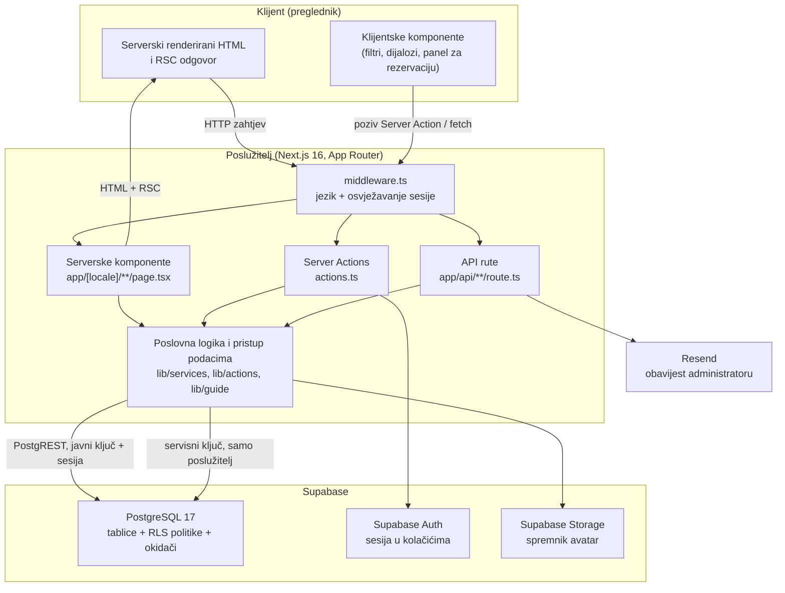
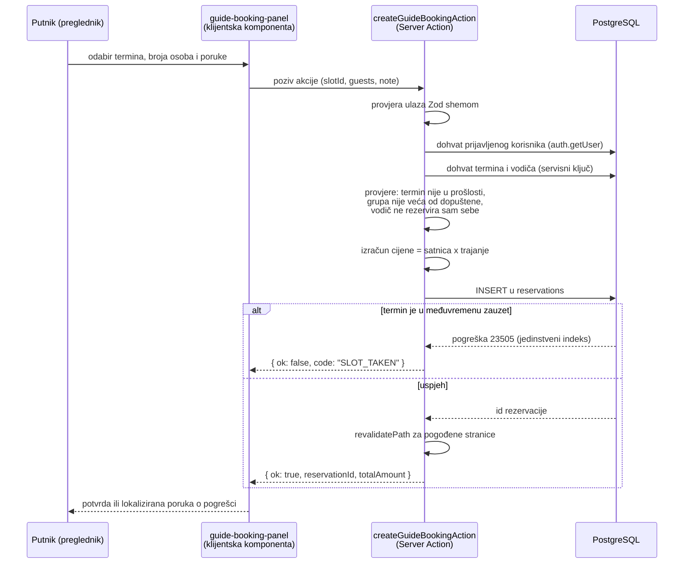
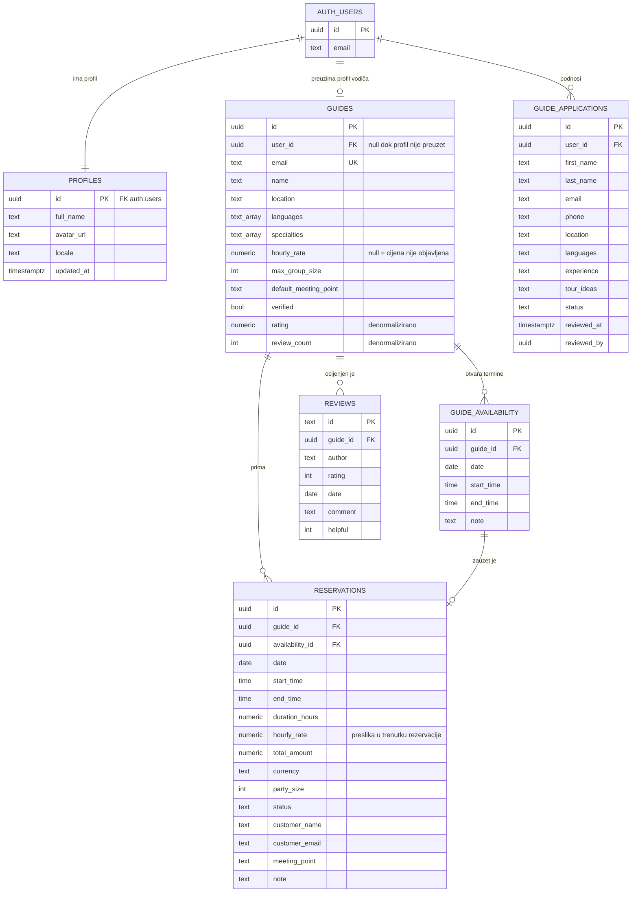
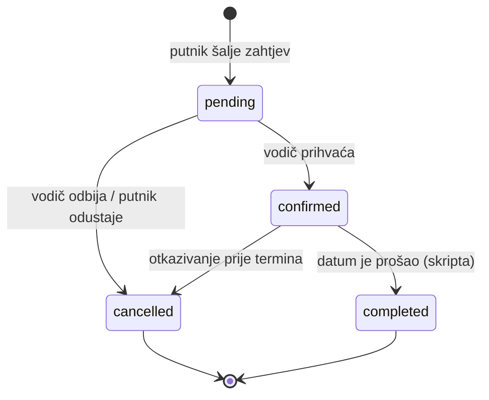

# 4. ARHITEKTURA SUSTAVA I MODEL PODATAKA

U prethodnom su poglavlju opisane tehnologije od kojih je aplikacija sastavljena. U ovom je poglavlju opisano kako su te tehnologije međusobno povezane: od kojih se slojeva sustav sastoji, kako podaci putuju od preglednika do baze podataka i natrag, kako je izvorni kod organiziran u direktorije i module te, na kraju, kako je oblikovan model podataka nad kojim cijela aplikacija radi.

Središnja odluka koja je oblikovala i arhitekturu i model podataka jest da je jedinica koja se rezervira **vodič**, a ne proizvod koji vodič nudi. Putnik ne kupuje unaprijed definiranu turu s fiksnim brojem mjesta, već rezervira blok vremena određene osobe. Zbog toga cijena, dostupnost, područja interesa i ocjena pripadaju zapisu o vodiču, a ne zapisu o turi. Ta je odluka detaljno obrazložena u poglavlju 4.3, ali se njezine posljedice vide i u organizaciji ruta opisanoj u poglavlju 4.2.

## 4.1. Pregled arhitekture (klijent – Next.js poslužitelj – Supabase)

Aplikacija je izvedena kao troslojni sustav. Prvi je sloj preglednik, u kojem se izvodi korisničko sučelje. Drugi je sloj poslužitelj okvira Next.js, na kojem se odvija renderiranje stranica, provjera ispravnosti podataka i sva poslovna logika. Treći je sloj Supabase, koji objedinjuje relacijsku bazu podataka, uslugu autentikacije i pohranu datoteka.

Za razliku od klasične podjele na odvojenu klijentsku aplikaciju i zaseban poslužiteljski API, ovdje ne postoji vlastiti sloj API-ja koji bi posredovao između sučelja i baze podataka. Serverske komponente i Server Actions izravno komuniciraju sa Supabaseom, koristeći sesiju prijavljenog korisnika, dok se autorizacija provodi u samoj bazi podataka mehanizmom sigurnosti na razini redova. Time je uklonjen cijeli sloj koda koji bi inače postojao samo zato da prosljeđuje podatke, a ujedno je i pravilo pristupa zapisano na jednom mjestu — u bazi — umjesto da se ponavlja u svakoj krajnjoj točki API-ja.

Slika 4.1 prikazuje slojeve sustava i smjer komunikacije među njima.



*Slika 4.1. Slojevi sustava i smjer komunikacije (Autor)*

**Klijentski sloj.** U pregledniku se izvodi samo onaj dio sučelja koji zahtijeva interakciju. Stranice koje podatke isključivo prikazuju — popis vodiča, javni profil vodiča, popis rezervacija — izvedene su serverskim komponentama i u preglednik stižu kao gotov HTML, bez pripadajućeg JavaScript koda. Klijentske komponente, označene direktivom `"use client"`, korištene su za filtriranje u pregledniku vodiča (`components/browse/browse-client.tsx`), za panel kojim putnik odabire termin i šalje zahtjev (`components/guide/guide-booking-panel.tsx`) te za zvono s obavijestima (`components/notifications/notifications-bell.tsx`). Takva podjela znači da količina JavaScript koda koji se preuzima ne raste s brojem stranica, već samo s brojem stvarno interaktivnih dijelova sučelja.

**Poslužiteljski sloj.** Poslužitelj okvira Next.js ima tri ulazne točke. Prva su serverske komponente, koje pri renderiranju stranice pozivaju funkcije za dohvat podataka iz direktorija `lib`. Druga su Server Actions, asinkrone funkcije koje se pozivaju iz obrazaca i mijenjaju podatke. Treća su API rute, korištene tamo gdje odgovor nije HTML stranica — pri predaji prijave za vodiča, pri dohvatu obavijesti iz preglednika i pri generiranju kalendarske datoteke.

Prije svake od tih ulaznih točaka izvodi se međuprogram definiran u datoteci `middleware.ts`. On obavlja dvije radnje: određuje jezik na temelju prvog segmenta putanje i osvježava korisničku sesiju. Druga je radnja nužna zato što serverske komponente ne mogu postavljati kolačiće; bez osvježavanja u međuprogramu pristupni bi token istekao nakon jednog sata, pa bi serverski renderirane stranice prestale prepoznavati prijavljenog korisnika iako preglednik i dalje drži valjanu sesiju.

**Podatkovni sloj.** Supabase u ovoj arhitekturi nije samo mjesto pohrane, već i mjesto na kojem se provodi autorizacija. Pravila pristupa zapisana su kao RLS politike uz svaku tablicu, pa ista pravila vrijede neovisno o tome koji dio aplikacije postavlja upit. Osim baze podataka, koriste se i usluga autentikacije, koja sesiju čuva u kolačićima, te pohrana datoteka, u kojoj su smještene profilne slike korisnika i vodiča.

Tablica 4.1 sažima odgovornosti pojedinih slojeva.

| Sloj | Odgovornost | Što se ondje **ne** nalazi |
| --- | --- | --- |
| Preglednik | prikaz, unos, interakcija, trenutna povratna informacija | poslovna pravila, izračun cijene, provjera ovlaštenja |
| Next.js poslužitelj | renderiranje, provjera ispravnosti, izračun cijene, orkestracija upita | trajna pohrana podataka |
| PostgreSQL (Supabase) | pohrana, referencijalni integritet, autorizacija (RLS), agregacija ocjena | oblikovanje teksta i prijevodi |
| Supabase Auth | identitet korisnika, sesija, ponovno postavljanje lozinke | uloge specifične za domenu (vodič, administrator) |
| Supabase Storage | binarne datoteke (slike) | metapodaci o slikama (u bazi se čuva samo putanja) |

*Tablica 4.1. Odgovornosti pojedinih slojeva sustava (Autor)*

**Tijek zahtjeva za prikaz stranice.** Kada korisnik zatraži, primjerice, javni profil vodiča na adresi `/hr/guides/<id>`, redoslijed je sljedeći:

1. Međuprogram prepoznaje jezični segment `hr` i osvježava sesiju, upisujući nove kolačiće u odgovor.
2. Serverska komponenta `app/[locale]/guides/[guideId]/page.tsx` poziva funkciju `fetchGuideProfile` iz direktorija `lib/services`.
3. Ta funkcija u jednom prolazu pokreće tri usporedna upita: podatke o vodiču, njegove termine u sljedećih 60 dana i posljednjih šest recenzija.
4. Baza podataka na svaki upit primjenjuje RLS politike i vraća samo one retke koje pozivatelj smije vidjeti.
5. Rezultat se preslikava u domenske tipove definirane u `lib/types` i predaje komponentama.
6. U preglednik se šalje gotov HTML, uz mali paket JavaScript koda potreban isključivo za panel za rezervaciju.

**Tijek zahtjeva koji mijenja podatke.** Slika 4.2 prikazuje najsloženiji takav tijek u aplikaciji — slanje zahtjeva za rezervaciju.



*Slika 4.2. Tijek stvaranja rezervacije (Autor)*

Dva su detalja tog tijeka arhitektonski važna. Prvi je da se cijena nikada ne prima iz preglednika: klijent šalje samo identifikator termina, broj osoba i poruku, dok se satnica, trajanje i ukupan iznos izvode na poslužitelju iz zapisa u bazi. Drugi je način rješavanja istovremenih zahtjeva za isti termin. Umjesto da se stanje termina prvo pročita pa zatim upiše — što ostavlja prostor da dva zahtjeva prođu provjeru istovremeno — oslonjeno je na djelomični jedinstveni indeks `reservations_one_active_per_slot`, opisan u poglavlju 4.3. Sam upis je zaključavanje: drugi zahtjev za isti termin odbija baza podataka pogreškom `23505`, koju akcija prevodi u poruku da je termin upravo zauzet.

**Dva Supabase klijenta i model povjerenja.** Aplikacija koristi dvije vrste veze prema bazi podataka, ovisno o tome u čije se ime radnja izvodi. Uobičajeni klijent koristi javni ključ i sesiju prijavljenog korisnika, pa se na sve njegove upite primjenjuju RLS politike. Administratorski klijent stvara se servisnim ključem i zaobilazi RLS, zbog čega se koristi isključivo u poslužiteljskom kodu i tek nakon što je pravo na radnju već provjereno.

| Svojstvo | Uobičajeni klijent | Administratorski klijent |
| --- | --- | --- |
| Datoteka | `lib/supabase/server.ts`, `lib/supabase/client.ts` | `lib/supabase/admin.ts` |
| Ključ | javni ključ (`NEXT_PUBLIC_...`) | servisni ključ (`SUPABASE_SERVICE_ROLE_KEY`) |
| RLS | primjenjuje se | zaobilazi se |
| Dostupan pregledniku | da | ne, nikada |
| Tipična upotreba | dohvat vodiča, termina i rezervacija u ime korisnika | upis rezervacije, obrada prijave za vodiča, zatvaranje isteklih rezervacija |

*Tablica 4.2. Usporedba dvaju načina pristupa bazi podataka (Autor)*

Upis rezervacije namjerno se izvodi administratorskim klijentom. Da putnik ima pravo izravnog upisa u tablicu `reservations`, mogao bi upisati proizvoljnu satnicu ili ukupan iznos. Ovako putnik nema nikakvo pravo pisanja po toj tablici, a jedini put do novog zapisa vodi kroz Server Action koja sve novčane vrijednosti izvodi sama.

**Slojevi autorizacije.** Provjera prava izvedena je na tri razine, pri čemu svaka ima drukčiju svrhu:

- *Zaštita rute.* Funkcije `requireGuide` i `requireAdminUser` izvode se na početku renderiranja zaštićenih stranica. Neprijavljenog posjetitelja preusmjeravaju na prijavu, a prijavljenog korisnika bez odgovarajućeg profila na obrazac za prijavu za vodiča, odnosno na naslovnicu. Ta razina služi ispravnom korisničkom iskustvu, a ne sigurnosti.
- *Provjera u poslužiteljskoj logici.* Svaka Server Action i svaka API ruta koja mijenja podatke ulaz provjerava Zod shemom te ponovno utvrđuje identitet i pravo korisnika prije pristupa bazi.
- *Sigurnost na razini redova.* Konačna provjera je u bazi podataka. I kada bi prve dvije razine bile zaobiđene, politike opisane u poglavlju 4.3 spriječile bi vodiča da vidi tuđe rezervacije ili putnika da mijenja tuđi zapis.

Uloga administratora nije zapisana u bazi podataka, već se izvodi iz varijable okruženja `ADMIN_EMAILS`, koja sadrži popis adresa e-pošte odvojenih zarezom. Riječ je o svjesnom pojednostavljenju primjerenom opsegu rada: administratorski dio aplikacije koristi uzak krug ljudi, pa uvođenje zasebne tablice uloga ne bi donijelo dodatnu vrijednost.

**Popratne usluge.** Uz tri glavna sloja, sustav se oslanja i na tri sporedna mehanizma. Profilne se slike učitavaju u Supabase Storage, pri čemu se u bazi čuva samo putanja objekta, a javna se adresa izvodi u trenutku renderiranja. Obavijest o novoj prijavi za turističkog vodiča šalje se uslugom Resend, i to na način koji ne može spriječiti osnovnu funkcionalnost: ako slanje nije konfigurirano ili ne uspije, prijava se svejedno pohranjuje. Konačno, prijelaz potvrđene rezervacije u stanje *završeno* nije radnja nijedne od dviju strana, već posljedica protoka vremena, pa ga obavlja funkcija `settleCompletedReservations`. Ona se poziva na dva načina — skriptom `npm run reservations:settle`, namijenjenom periodičnom pokretanju, i oportunistički pri renderiranju stranica, uz ograničenje od najviše jednog izvođenja u pet minuta po instanci poslužitelja.

## 4.2. Struktura projekta i organizacija ruta

Izvorni je kod organiziran prema odgovornosti, a ne prema tehničkoj vrsti datoteke. Rute se nalaze u direktoriju `app`, sučelje u direktoriju `components`, a sva poslovna logika i pristup podacima u direktoriju `lib`. Takva podjela znači da stranica sadrži gotovo isključivo prikaz, dok se logika koju je moguće testirati i ponovno upotrijebiti nalazi izvan stabla ruta.

Slika 4.3 prikazuje strukturu projekta na prve dvije razine.

```
zavrsni/
├── app/                        rute aplikacije (App Router)
│   ├── layout.tsx              korijenski izgled, <html>, fontovi, Analytics
│   ├── page.tsx                preusmjeravanje na zadani jezik
│   ├── globals.css             CSS varijable tema i uvoz Tailwind CSS-a
│   ├── [locale]/               sve stranice, unutar jezičnog segmenta
│   └── api/                    API rute (Route Handlers)
├── components/                 React komponente
│   ├── ui/                     shadcn/ui komponente
│   ├── auth/  browse/  cards/  guide/  homepage/  layout/  notifications/
│   ├── navigation.tsx
│   └── footer.tsx
├── lib/                        poslovna logika i pristup podacima
│   ├── actions/  services/  guide/  bookings/  reservations/
│   ├── supabase/  auth/  validation/  types/
│   └── i18n/  format/  media/  email/  notifications/
├── i18n/                       konfiguracija knjižnice next-intl
├── messages/                   prijevodi (en.json, hr.json)
├── supabase/                   config.toml i migracije baze podataka
├── scripts/                    pomoćne Node.js skripte
├── public/                     statične datoteke i slike
├── docs/                       dokumentacija
├── middleware.ts               jezik i osvježavanje sesije
└── next.config.ts              konfiguracija okvira
```

*Slika 4.3. Struktura direktorija projekta (Autor)*

| Direktorij | Sadržaj i namjena |
| --- | --- |
| `app/[locale]` | sve stranice aplikacije, unutar dinamičkog jezičnog segmenta |
| `app/api` | krajnje točke čiji odgovor nije HTML stranica |
| `components/ui` | osnovne komponente sučelja preuzete iz zbirke shadcn/ui |
| `components/<domena>` | komponente vezane uz određeni dio domene (vodič, pregled, obavijesti) |
| `lib/services` | funkcije za **čitanje** podataka iz baze |
| `lib/actions` | Server Actions koje podatke **mijenjaju**, dijeljene među rutama |
| `lib/supabase` | stvaranje klijenata, osvježavanje sesije, rad s pohranom datoteka |
| `lib/types` | domenski tipovi i pomoćne funkcije nad njima |
| `lib/validation` | Zod sheme za provjeru ulaznih podataka |
| `lib/auth`, `lib/guide` | provjere prava pristupa i pomoćne funkcije za vodiča |
| `lib/i18n` | ključevi poruka koje se prenose kroz adresu (engl. *flash messages*) |
| `supabase/migrations` | SQL migracije koje definiraju strukturu baze podataka |
| `scripts` | skripte za unos početnih podataka i zatvaranje isteklih rezervacija |

*Tablica 4.3. Namjena glavnih direktorija projekta (Autor)*

**Organizacija ruta u direktoriju `app/[locale]`.** Budući da je jezik dio adrese, cijela je aplikacija smještena unutar dinamičkog segmenta `[locale]`. Datoteka `app/page.tsx` u korijenu preusmjerava posjetitelja bez jezičnog segmenta na zadani jezik, dok se stvarne stranice nalaze jednu razinu niže. Tablica 4.4 prikazuje sve rute aplikacije, uz naznaku kojoj su skupini korisnika namijenjene.

| Ruta | Datoteka | Namjena | Pristup |
| --- | --- | --- | --- |
| `/[locale]` | `page.tsx` | naslovnica s istaknutim vodičima | javno |
| `/[locale]/browse` | `browse/page.tsx` | pregled i filtriranje vodiča | javno |
| `/[locale]/guides/[guideId]` | `guides/[guideId]/page.tsx` | javni profil vodiča i slanje zahtjeva | javno (rezervacija zahtijeva prijavu) |
| `/[locale]/how-it-works` | `how-it-works/page.tsx` | objašnjenje načina korištenja | javno |
| `/[locale]/become-guide` | `become-guide/page.tsx` | obrazac za prijavu za vodiča | javno |
| `/[locale]/auth/sign-in` | `auth/sign-in/page.tsx` | prijava e-poštom ili Google računom | javno |
| `/[locale]/auth/sign-up` | `auth/sign-up/page.tsx` | registracija | javno |
| `/[locale]/auth/forgot-password` | `auth/forgot-password/page.tsx` | zahtjev za ponovno postavljanje lozinke | javno |
| `/[locale]/auth/update-password` | `auth/update-password/page.tsx` | postavljanje nove lozinke | prijavljeni |
| `/[locale]/auth/callback` | `auth/callback/route.ts` | povratna adresa za OAuth i poveznice iz e-pošte | javno |
| `/[locale]/auth/sign-out` | `auth/sign-out/route.ts` | odjava | prijavljeni |
| `/[locale]/profile` | `profile/page.tsx` | korisnički profil, ime, jezik i slika | prijavljeni |
| `/[locale]/bookings` | `bookings/page.tsx` | rezervacije putnika i njihovo otkazivanje | prijavljeni |
| `/[locale]/guide` | `guide/page.tsx` | nadzorna ploča vodiča s pokazateljima | vodič |
| `/[locale]/guide/schedule` | `guide/schedule/page.tsx` | raspored vodiča po odabranom razdoblju | vodič |
| `/[locale]/guide/events` | `guide/events/page.tsx` | otvaranje i uklanjanje termina | vodič |
| `/[locale]/guide/reservations` | `guide/reservations/page.tsx` | potvrda i odbijanje zahtjeva | vodič |
| `/[locale]/guide/profile` | `guide/profile/page.tsx` | uređivanje javnog profila, satnice i specijalnosti | vodič |
| `/[locale]/admin/guide-applications` | `admin/guide-applications/page.tsx` | popis prijava za vodiča | administrator |
| `/[locale]/admin/guide-applications/[id]` | `admin/guide-applications/[id]/page.tsx` | pregled i obrada pojedinačne prijave | administrator |

*Tablica 4.4. Rute aplikacije i njihova dostupnost (Autor)*

Uz stranice, u direktoriju `browse` nalaze se i datoteke `loading.tsx` i `error.tsx`, kojima su definirani prikaz tijekom učitavanja i prikaz u slučaju pogreške. Riječ je o dijelu aplikacije koji dohvaća najviše podataka, pa je ondje povratna informacija o učitavanju najuočljivija.

**API rute.** Samo tri krajnje točke ne vraćaju HTML stranicu, pa su izvedene kao API rute.

| Ruta | Metoda | Namjena |
| --- | --- | --- |
| `/api/guide-applications` | POST | zaprimanje prijave za turističkog vodiča i obavještavanje administratora |
| `/api/notifications` | GET | dohvat obavijesti za prijavljenog korisnika iz preglednika |
| `/api/reservations/[reservationId]/calendar` | GET | generiranje datoteke u formatu iCalendar za potvrđenu rezervaciju |

*Tablica 4.5. API rute aplikacije (Autor)*

Izbor između API rute i Server Action nije proizvoljan. Server Actions korištene su svugdje gdje je rezultat radnje novo stanje stranice, jer u tom slučaju nije potrebno pisati posebnu krajnju točku niti ručno slati zahtjev iz preglednika. API rute korištene su u tri slučaja u kojima to ne vrijedi: kada odgovor mora biti JSON koji preglednik dohvaća periodično (obavijesti), kada odgovor mora biti datoteka s vlastitim MIME tipom (kalendar) te kada obrazac šalje klijentska komponenta koja rezultat obrađuje sama, bez preusmjeravanja (prijava za vodiča).

**Organizacija poslužiteljske logike.** Direktorij `lib` podijeljen je prema odgovornosti, uz jasnu razliku između čitanja i pisanja.

| Modul | Sadržaj |
| --- | --- |
| `lib/services/guide-service.ts` | dohvat vodiča za pregled i za javni profil |
| `lib/services/availability-service.ts` | dohvat termina, izračun zauzetosti i sažetaka dostupnosti |
| `lib/services/review-service.ts` | dohvat recenzija vodiča |
| `lib/actions/reservation-actions.ts` | stvaranje rezervacije s provjerama i izračunom cijene |
| `lib/actions/guide-actions.ts` | normalizacija filtara te filtriranje i sortiranje za pregled vodiča |
| `lib/guide/require-guide.ts`, `lib/auth/require-admin.ts` | zaštita ruta i preusmjeravanja |
| `lib/guide/guide-dashboard-data.ts` | dohvat podataka i izračun pokazatelja nadzorne ploče |
| `lib/guide/booking-access.ts` | provjera smije li posjetitelj vidjeti kontaktne podatke vodiča |
| `lib/bookings/get-traveller-bookings.ts` | dohvat rezervacija putnika |
| `lib/reservations/settle-completed.ts` | zatvaranje rezervacija čiji je termin prošao |
| `lib/notifications/notifications.ts` | objedinjavanje obavijesti za obje strane |

*Tablica 4.6. Podjela poslužiteljske logike u direktoriju `lib` (Autor)*

Server Actions pojavljuju se na dva mjesta, ovisno o dosegu. One koje koristi samo jedna ruta nalaze se u datoteci `actions.ts` unutar direktorija te rute — primjerice `app/[locale]/guide/events/actions.ts` za otvaranje termina ili `app/[locale]/bookings/actions.ts` za otkazivanje rezervacije. One koje se pozivaju iz više mjesta, kao stvaranje rezervacije koje se poziva iz klijentske komponente na profilu vodiča, izdvojene su u `lib/actions`. Takav dogovor drži logiku blizu mjesta upotrebe, a dijeli samo ono što je stvarno dijeljeno.

**Granica između poslužitelja i preglednika.** Klijentskih je komponenata u projektu namjerno malo, a svaka od njih ima jasan razlog postojanja: pregled vodiča jer filtre održava bez ponovnog učitavanja stranice, panel za rezervaciju jer prikuplja unos i obrađuje ishod akcije, zvono s obavijestima jer periodično dohvaća podatke, prekidač jezika i tema jer reagiraju na korisnički odabir. Sve ostalo, uključujući sve stranice u tablici 4.4, izvedeno je serverskim komponentama.

Posljedica te granice vidljiva je i u sigurnosti. Sve što serverska komponenta pročita iz baze podataka završava u odgovoru poslanom pregledniku, pa se podaci koji ne smiju biti javni ne dohvaćaju „za svaki slučaj”. Kontaktni podaci vodiča zato su izdvojeni u zaseban upit koji se izvodi tek nakon što je utvrđeno da posjetitelj ima potvrđenu rezervaciju kod tog vodiča ili da je riječ o vlasniku profila. Stupci koji nikada nisu odabrani ne mogu ni procuriti.

## 4.3. Model podataka i ER dijagram

Model podataka izgrađen je oko šest tablica u shemi `public`, uz tablicu `auth.users` kojom upravlja usluga Supabase Auth. Struktura je definirana SQL migracijama u direktoriju `supabase/migrations`, čime je i sama baza podataka dio izvornog koda projekta.

**Polazišna odluka.** Prvotni model bio je usmjeren na proizvod: vodič je objavljivao ture, tura je imala termine i cijenu po osobi, a rezervacija se odnosila na turu. Takav model ima tri nedostatka za domenu ovog rada. Prvo, vodič nije mogao otvoriti nijedan slobodan datum bez da prethodno izmisli proizvod. Drugo, cijena po osobi opisuje kupnju mjesta, a ne angažiranje osobe. Treće, identitet vodiča — njegova područja interesa, ocjena i lokacija — postojao je samo kao posljedica tura koje je objavio, pa vodič bez objavljene ture nije imao profil.

Zbog toga je model preustrojen tako da je nositelj ponude sam vodič. Satnica, popis specijalnosti, najveća veličina grupe i uobičajeno mjesto susreta stupci su tablice `guides`. Jedinica koja se rezervira je **termin** — blok vremena koji vodič otvori — a cijena rezervacije jednaka je satnici pomnoženoj s trajanjem tog bloka. Recenzija se odnosi na vodiča, a ne na proizvod.

### 4.3.1. Entiteti

**`profiles`** — korisnički profil svakog registriranog korisnika. Primarni ključ istovremeno je i strani ključ prema `auth.users`, čime je uspostavljen odnos jedan naprama jedan s računom u sustavu autentikacije. Zapis stvara okidač `handle_new_user` pri registraciji, a funkcija `ensureProfile` naknadno ga stvara za korisnike prijavljene putem vanjskog pružatelja identiteta.

| Stupac | Tip | Opis |
| --- | --- | --- |
| `id` | `uuid`, PK, FK → `auth.users` | identifikator korisnika |
| `full_name` | `text` | ime i prezime |
| `avatar_url` | `text` | putanja profilne slike u pohrani |
| `locale` | `text` | preferirani jezik sučelja |
| `updated_at` | `timestamptz` | vrijeme zadnje izmjene, održava okidač |

*Tablica 4.7. Struktura tablice `profiles` (Autor)*

**`guides`** — profil turističkog vodiča i, nakon preustroja modela, nositelj cjelokupne ponude. Zapis nastaje kada administrator prihvati prijavu, i to prema adresi e-pošte iz prijave. Stupac `user_id` povezuje profil s korisničkim računom; dok je prazan, profil postoji, ali još nije preuzet, pa aplikacija prijavljenom korisniku s istom adresom nudi preuzimanje.

| Stupac | Tip | Opis |
| --- | --- | --- |
| `id` | `uuid`, PK | identifikator vodiča |
| `user_id` | `uuid`, FK → `auth.users` | korisnički račun koji je preuzeo profil; `null` dok nije preuzet |
| `email` | `text`, jedinstven | adresa e-pošte, ključ povezivanja s prijavom |
| `name`, `phone`, `location` | `text` | osnovni podaci |
| `avatar` | `text` | putanja profilne fotografije |
| `languages` | `text[]` | jezici na kojima vodič vodi |
| `verified` | `boolean` | oznaka provjerenog vodiča |
| `headline`, `bio`, `website` | `text` | javni opis profila |
| `years_experience` | `integer` | godine iskustva, ograničeno na 0–80 |
| `hourly_rate` | `numeric(10,2)` | satnica u eurima; `null` znači da cijena još nije objavljena |
| `specialties` | `text[]` | područja interesa, ograničena na pet dopuštenih vrijednosti |
| `max_group_size` | `integer` | najveća grupa koju vodič prima, ograničeno na 1–100 |
| `default_meeting_point` | `text` | uobičajeno mjesto susreta |
| `rating` | `numeric(3,2)` | prosječna ocjena, održava okidač |
| `review_count` | `integer` | broj recenzija, održava okidač |
| `updated_at` | `timestamptz` | vrijeme zadnje izmjene |

*Tablica 4.8. Struktura tablice `guides` (Autor)*

**`guide_availability`** — blok vremena koji je vodič otvorio. To je jedinica koja se rezervira: putnik uzima cijeli blok, a ne mjesto u njemu.

| Stupac | Tip | Opis |
| --- | --- | --- |
| `id` | `uuid`, PK | identifikator termina |
| `guide_id` | `uuid`, FK → `guides`, `on delete cascade` | vodič kojemu termin pripada |
| `date` | `date` | datum termina |
| `start_time`, `end_time` | `time` | početak i kraj bloka |
| `note` | `text` | interna oznaka koju vodič daje bloku |
| `created_at` | `timestamptz` | vrijeme unosa |

*Tablica 4.9. Struktura tablice `guide_availability` (Autor)*

**`reservations`** — jedan putnik na jednom terminu. Osim veza, zapis sadrži i presliku vrijednosti u trenutku rezervacije, o čemu je više riječi među ograničenjima integriteta.

| Stupac | Tip | Opis |
| --- | --- | --- |
| `id` | `uuid`, PK | identifikator rezervacije |
| `guide_id` | `uuid`, FK → `guides` | vodič |
| `availability_id` | `uuid`, FK → `guide_availability`, `on delete set null` | rezervirani termin |
| `date`, `start_time`, `end_time` | `date`, `time` | vrijeme susreta, prepisano s termina |
| `duration_hours` | `numeric(4,2)` | trajanje u satima |
| `hourly_rate` | `numeric(10,2)` | satnica u trenutku rezervacije |
| `total_amount` | `numeric` | ukupan iznos; `null` kada cijena nije objavljena |
| `currency` | `text` | valuta, u aplikaciji uvijek `EUR` |
| `party_size` | `integer` | broj osoba |
| `status` | `text` | `pending`, `confirmed`, `cancelled` ili `completed` |
| `customer_name`, `customer_email` | `text` | podaci putnika, preuzeti iz sesije |
| `meeting_point` | `text` | dogovoreno mjesto susreta |
| `interests` | `text[]` | područja interesa vezana uz zahtjev; stupac i akcija su pripremljeni, ali ih trenutačno sučelje još ne popunjava |
| `note` | `text` | poruka putnika vodiču |
| `created_at`, `updated_at` | `timestamptz` | vremenske oznake |

*Tablica 4.10. Struktura tablice `reservations` (Autor)*

Stupac `note` postojao je i u prvotnom modelu, ali se u njega nikada nije upisivalo. Umjesto uvođenja novog stupca uz njega, preuzeo je značenje poruke koju putnik piše uz zahtjev.

**`reviews`** — recenzija vodiča. Nakon preustroja modela stupac `guide_id` postao je nositelj veze, a postojeći su zapisi prebačeni s tura na njihove vodiče.

| Stupac | Tip | Opis |
| --- | --- | --- |
| `id` | `text`, PK | identifikator recenzije |
| `guide_id` | `uuid`, FK → `guides`, `on delete cascade` | recenzirani vodič |
| `author`, `avatar` | `text` | ime i slika autora |
| `rating` | `integer` | ocjena od 1 do 5 |
| `date` | `date` | datum recenzije |
| `comment` | `text` | tekst recenzije |
| `helpful` | `integer` | broj oznaka korisnosti |

*Tablica 4.11. Struktura tablice `reviews` (Autor)*

**`guide_applications`** — prijava za turističkog vodiča i evidencija njezine obrade.

| Stupac | Tip | Opis |
| --- | --- | --- |
| `id` | `uuid`, PK | identifikator prijave |
| `user_id` | `uuid`, FK → `auth.users` | podnositelj, ako je bio prijavljen |
| `first_name`, `last_name`, `email`, `phone`, `location` | `text` | osobni podaci |
| `languages`, `experience`, `tour_ideas` | `text` | sadržaj prijave |
| `agreed_to_terms` | `boolean` | potvrda uvjeta korištenja |
| `locale` | `text` | jezik na kojem je prijava predana |
| `status` | `text` | `pending`, `accepted`, `accepted_verified` ili `declined` |
| `reviewed_at` | `timestamptz` | vrijeme obrade |
| `reviewed_by` | `uuid` | administrator koji je prijavu obradio |
| `review_note` | `text` | interna bilješka uz odluku |
| `created_at` | `timestamptz` | vrijeme predaje |

*Tablica 4.12. Struktura tablice `guide_applications` (Autor)*

### 4.3.2. ER dijagram

Slika 4.4 prikazuje entitete, njihove ključne atribute i odnose među njima.



*Slika 4.4. ER dijagram baze podataka (Autor)*

### 4.3.3. Odnosi i kardinalnosti

- **`auth.users` – `profiles` (1 : 1).** Svaki registrirani korisnik ima točno jedan profil; primarni ključ profila ujedno je i strani ključ prema računu.
- **`auth.users` – `guides` (1 : 0..1).** Korisnik može, ali ne mora, imati profil vodiča. Profil vodiča može postojati i prije nego što ga je itko preuzeo, jer ga stvara administrator prihvaćanjem prijave.
- **`guides` – `guide_availability` (1 : N).** Vodič otvara proizvoljan broj termina. Brisanje vodiča kaskadno briše njegove termine.
- **`guides` – `reservations` (1 : N).** Vodič prima proizvoljan broj rezervacija.
- **`guide_availability` – `reservations` (1 : 0..1 aktivnih).** Termin u svakom trenutku može imati najviše jednu aktivnu rezervaciju, ali može imati više otkazanih. To ograničenje nije izvedeno običnim jedinstvenim ključem, već djelomičnim indeksom opisanim u nastavku.
- **`guides` – `reviews` (1 : N).** Recenzije se odnose na vodiča.
- **`auth.users` – `guide_applications` (1 : N).** Korisnik može podnijeti više prijava, a prijava može postojati i bez povezanog računa, ako je predana bez prijave u sustav.

### 4.3.4. Ograničenja integriteta

Značajan dio poslovnih pravila zapisan je u samoj bazi podataka, pa vrijedi neovisno o tome koji ih dio aplikacije zaobiđe.

**Djelomični jedinstveni indeks nad terminom.** Pravilo „jedan termin, najviše jedna aktivna rezervacija” izvedeno je indeksom `reservations_one_active_per_slot` nad stupcem `availability_id`, uz uvjet da rezervacija ima pridružen termin i da je u stanju `pending` ili `confirmed`. Rješenje je odabrano zato što obični jedinstveni ključ ne bi dopustio da isti termin nakon otkazivanja ponovno bude rezerviran. Ujedno je time uklonjena potreba za zaključavanjem u aplikacijskom kodu: sam upis rezervacije je zaključavanje, a istovremeni drugi zahtjev odbija baza podataka.

**Provjere vrijednosti.** Nad tablicom `guides` definirana su ograničenja koja satnicu drže u rasponu od 0 do 10 000, veličinu grupe od 1 do 100, ocjenu od 0 do 5 te godine iskustva od 0 do 80. Ograničenje `guides_specialties_valid` provjerava da je polje `specialties` podskup dopuštenog skupa vrijednosti (`food`, `nature`, `culture`, `adventure`, `history`), čime se izbjegava zasebna šifrarnička tablica uz zadržanu kontrolu sadržaja. Nad tablicom `guide_availability` ograničenje `guide_availability_time_order` zahtijeva da je kraj bloka nakon njegova početka, a jedinstveni indeks nad trojkom (vodič, datum, početak) sprječava dvostruko otvaranje istog termina.

**Preslika cijene u trenutku rezervacije.** Stupci `hourly_rate`, `duration_hours` i `total_amount` u tablici `reservations` namjerno ponavljaju podatke koji se mogu izvesti iz drugih tablica. Razlog je vremenska ispravnost: kada bi se iznos računao iz trenutne satnice vodiča, promjena cjenika retroaktivno bi izmijenila sve postojeće rezervacije i sve pokazatelje prihoda. Isto vrijedi i za `meeting_point`, koji pripada konkretnom dogovoru, a ne profilu vodiča.

**Održavanje ocjena okidačem.** Stupci `rating` i `review_count` u tablici `guides` denormalizirani su kako pregled vodiča i naslovnica ne bi pri svakom zahtjevu agregirali cijelu tablicu recenzija. Njihova je jedina točka upisa okidač `refresh_guide_rating_on_reviews`, koji se izvodi nakon svakog unosa, izmjene i brisanja recenzije i poziva funkciju `recount_guide_reviews`. Funkcija ponovno izračunava prosjek i broj recenzija za pogođenog vodiča; ako je recenzija premještena s jednog vodiča na drugoga, osvježavaju se oba zapisa. Aplikacijski kod te stupce nikada ne mijenja izravno, pa nije moguće da se razidu s podacima iz kojih su izvedeni.

**Dopuštene prazne vrijednosti.** Vrijednost `null` u stupcu `hourly_rate` ima značenje, a ne predstavlja nedostatak podatka: znači da vodič još nije objavio cijenu i da je ona predmet dogovora. Zbog toga i `total_amount` u rezervaciji smije biti prazan — upis nule prikazao bi se putniku kao besplatna usluga, što nije istina.

### 4.3.5. Životni ciklus rezervacije

Stanje rezervacije zapisano je tekstualnim stupcem `status` s četiri dopuštene vrijednosti. Slika 4.5 prikazuje dopuštene prijelaze i tko ih pokreće.



*Slika 4.5. Dijagram stanja rezervacije (Autor)*

Stanja `pending` i `confirmed` zajednički se nazivaju aktivnima i jedina su koja zauzimaju termin, što je vidljivo i u uvjetu djelomičnog jedinstvenog indeksa. Otkazivanjem rezervacija prestaje zauzimati termin, pa on ponovno postaje dostupan drugim putnicima. Prijelaz u stanje `completed` ne pokreće nijedna od dviju strana, već protok vremena, pa ga izvodi funkcija opisana u poglavlju 4.1 jednim filtriranim upitom nad svim potvrđenim rezervacijama čiji je datum prošao.

### 4.3.6. Sigurnost na razini redova

Za sve tablice uključena je sigurnost na razini redova, a politike su definirane migracijama. Tablica 4.13 sažima pravila pristupa.

| Tablica | Radnja | Tko smije | Uvjet |
| --- | --- | --- | --- |
| `guide_availability` | čitanje | svi | otvoreni termini javni su podatak |
| `guide_availability` | unos, izmjena, brisanje | vodič | termin pripada profilu koji je korisnik preuzeo |
| `reservations` | čitanje | vodič | rezervacija je na njegovu profilu |
| `reservations` | čitanje | putnik | `customer_email` odgovara adresi iz sesije |
| `reservations` | izmjena | vodič | rezervacija je na njegovu profilu |
| `guides` | izmjena | vodič | `user_id` odgovara prijavljenom korisniku |
| `guide_applications` | čitanje | podnositelj | `user_id` odgovara prijavljenom korisniku |

*Tablica 4.13. Sažetak politika sigurnosti na razini redova (Autor)*

Dvije su odluke u tim politikama vrijedne posebnog objašnjenja. Prvo, putnik se prepoznaje po adresi e-pošte zapisanoj uz rezervaciju, a ne po identifikatoru korisnika, jer rezervacija ne nosi stupac `user_id`; usporedba se provodi neosjetljivo na velika i mala slova, nad adresom iz tokena sesije. Drugo, u tablici `reservations` ne postoji politika za unos. To nije propust, nego namjera: nijedan korisnik nema pravo izravnog upisa rezervacije, a jedini put do novog zapisa vodi kroz Server Action koja svaku novčanu vrijednost izvodi na poslužitelju.

Dostupnost termina, koju putnik vidi na profilu vodiča, iz istog se razloga ne dohvaća ugniježđenim upitom nad rezervacijama. Termini se čitaju iz tablice `guide_availability`, a zauzeti se prepoznaju zasebnim upitom koji dohvaća isključivo stupac `availability_id`. Da je rezervacija dohvaćena kao povezani zapis, u odgovoru poslanom pregledniku našlo bi se i ime putnika koji je termin zauzeo. Ovako putnik doznaje samo da termin više nije slobodan.

### 4.3.7. Naslijeđene tablice

Tablice `tours` i `tour_availability`, nastale u prvotnom modelu usmjerenom na proizvod, i dalje postoje u bazi podataka, ali ih aplikacija više ne čita niti u njih upisuje. Migracija koja je uvela model usmjeren na vodiča prenijela je iz njih podatke koji su bili potrebni: kategorije tura postale su specijalnosti vodiča, recenzije su preusmjerene s ture na njezina vodiča, a otvoreni datumi tura pretvoreni su u trosatne termine, kako baza s postojećim podacima ne bi ostala bez ijednog raspoloživog termina nakon prijelaza. Tablice su ostavljene namjerno, jer je brisanje podataka nepovratan korak koji treba provesti odvojeno i svjesno, a ne kao usputnu posljedicu promjene modela.
