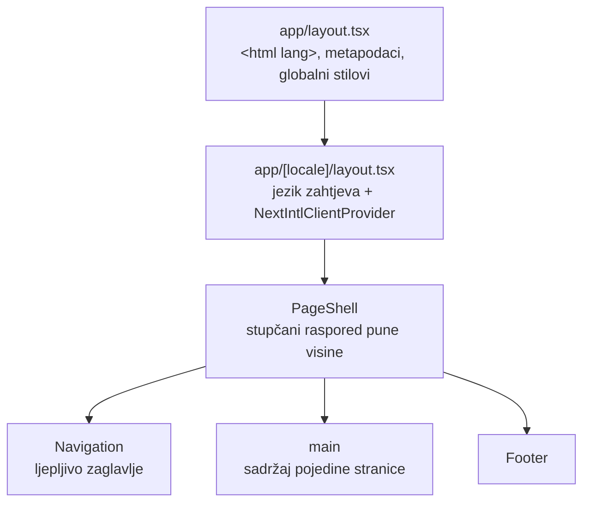
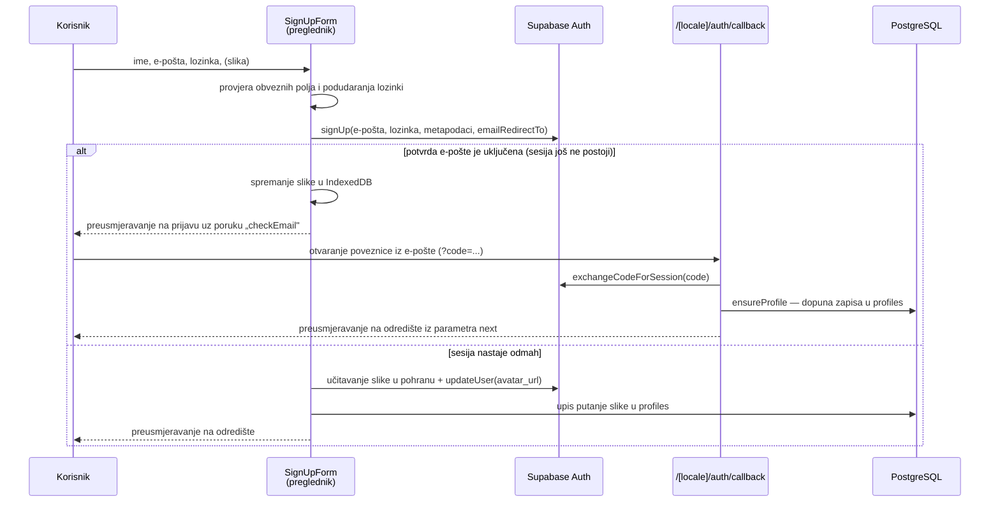
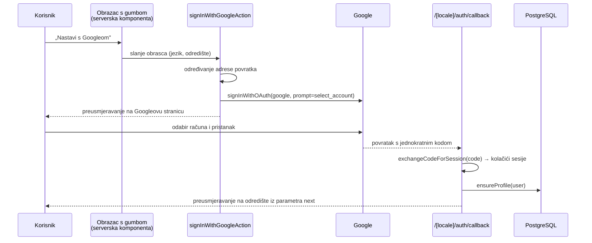
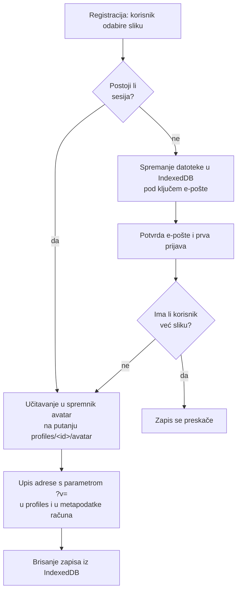

# 5. IMPLEMENTACIJA WEB APLIKACIJE

U prethodnom je poglavlju opisano od kojih se slojeva sustav sastoji i kako je oblikovan model podataka. U ovom je poglavlju prikazano kako se ta struktura očituje u samoj aplikaciji: koje stranice postoje, što korisnik na njima vidi i što se u pozadini izvodi kada pritisne gumb.

Izlaganje prati put kojim korisnik prolazi kroz aplikaciju. Prvo je opisan zajednički dio sučelja — okvir koji se ponavlja na svakoj stranici, naslovnica i stranica s objašnjenjem načina rada — jer je to ono što posjetitelj vidi prije nego što uopće otvori račun. Zatim je opisana autentikacija i sve što je vezano uz korisnički račun: registracija, prijava, prijava putem vanjskog pružatelja identiteta, ponovno postavljanje lozinke te uređivanje profila i profilne fotografije.

Uz opis sučelja, za svaku je cjelinu prikazano i ono što se ne vidi: koje se provjere provode, gdje se izvode i zašto su smještene baš ondje. U tekstu se koriste tri vrste priloga — slike (snimke zaslona i dijagrami), tablice i isječci izvornog koda označeni kao *Programski kod*.

## 5.1. Zajednički dio sučelja

Sve stranice aplikacije dijele isti vizualni okvir i isti skup gradivnih elemenata sučelja. Elementi su preuzeti iz zbirke shadcn/ui, koja komponente ne isporučuje kao vanjsku ovisnost, nego kao izvorni kod kopiran u direktorij `components/ui`, pa ih je moguće mijenjati bez zaobilaznih rješenja. Boje, radijusi i razmaci definirani su kao CSS varijable u datoteci `app/globals.css`, a Tailwind CSS ih koristi kroz semantička imena (`bg-background`, `text-muted-foreground`, `bg-primary`) umjesto konkretnih vrijednosti.

Paleta je izvedena u prostoru boja OKLCH, u kojem je svjetlina odvojena od tona, pa je kontrast moguće podešavati bez promjene same boje. Ta je mogućnost i iskorištena: osnovna boja marke posvijetljena je do vrijednosti pri kojoj bijeli tekst na gumbu doseže omjer kontrasta propisan smjernicama WCAG AA, dok je za sitni istaknuti tekst i tamne vrpce uvedena zasebna, tamnija varijanta iste boje (`--brand-deep`). Uz svijetlu paletu definiran je i potpun tamni skup vrijednosti pod selektorom `.dark`, čime je tamna tema pripremljena na razini stilova; prekidač kojim bi je korisnik uključivao nije dio opsega ovog rada.

### 5.1.1. Glavni izgled, navigacija i podnožje

**Korijenski izgled.** Datoteka `app/layout.tsx` jedini je izgled koji obuhvaća cijelu aplikaciju. U njoj se učitavaju globalni stilovi i fontovi mehanizmom `next/font`, postavlja se atribut `lang` na elementu `<html>` prema aktivnom jeziku te se uključuje modul za mjerenje posjećenosti. Naslov i opis stranice ne pišu se izravno, nego ih generira funkcija `generateMetadata`, koja ih dohvaća iz datoteka s prijevodima. Time je i sadržaj koji vide tražilice i društvene mreže lokaliziran, a ne samo tekst unutar stranice. Ikona stranice definirana je u tri varijante — za svijetlu i za tamnu shemu preglednika te u vektorskom formatu.

Jednu razinu niže, `app/[locale]/layout.tsx` postavlja jezik zahtjeva i omata sadržaj u `NextIntlClientProvider`, čime prijevodi postaju dostupni i klijentskim komponentama, a ne samo serverskima.

**Okvir stranice.** Zaglavlje i podnožje ne ponavljaju se u svakoj stranici, nego su objedinjeni u komponenti `PageShell` (`components/layout/page-shell.tsx`). Komponenta postavlja stupčani raspored visine cijelog zaslona u kojem sadržaj zauzima preostalu visinu, pa je podnožje uvijek na dnu i kod kratkih stranica. Prima dvije mogućnosti koje pokrivaju sve slučajeve u aplikaciji: `variant` određuje hoće li sadržaj biti omeđen središnjim spremnikom ograničene širine (`contained`) ili će se protezati cijelom širinom zaslona (`full`), a `paddingY` određuje okomiti razmak. Stranice s obrascima i popisima koriste omeđenu inačicu, dok naslovnica i stranica s objašnjenjem načina rada koriste punu širinu jer same slažu odjeljke s vlastitim pozadinama.



*Slika 5.1. Slaganje izgleda od korijenskog dokumenta do sadržaja stranice (Autor)*

**Navigacija.** Komponenta `components/navigation.tsx` prikazuje ljepljivo zaglavlje s poluprozirnom pozadinom i zamućenjem podloge. S lijeve je strane znak aplikacije, u sredini poveznice na glavne dijelove, a s desne strane prekidač jezika, zvono s obavijestima, avatar s imenom korisnika i gumb za odjavu.

Za razliku od većine sučelja u aplikaciji, navigacija je klijentska komponenta. Razlog je taj što se prikazuje na svakoj stranici i mora odražavati stanje prijave i onda kada se ono promijenilo bez ponovnog učitavanja stranice, pa sesiju čita izravno iz preglednika i pretplaćuje se na njezine promjene metodom `onAuthStateChange`. Time se izbjegava da korisnik nakon prijave u drugoj kartici i dalje vidi zaglavlje s gumbom „Prijava”.

Detalj koji rješava uočljiv problem prikaza jest početna vrijednost stanja sesije. Ona nije `null`, nego `undefined`, pri čemu `undefined` znači „još se učitava”. Da je početna vrijednost bila `null`, prijavljeni bi korisnik pri svakom otvaranju stranice na djelić sekunde vidio odjavljeno zaglavlje, a zatim prijavljeno. Dok je stanje `undefined`, ne prikazuje se nijedna od dviju inačica.

Sadržaj izbornika nije statičan. Poveznica prema dijelu za vodiče mijenja odredište ovisno o tome ima li prijavljeni korisnik profil vodiča, a provjera se izvodi u dva koraka: prvo prema stupcu `user_id`, a zatim, ako profil još nije preuzet, prema adresi e-pošte. Time nadzorna ploča postaje dostupna već korisniku čiju je prijavu administrator prihvatio, i prije nego što je profil formalno preuzeo.

```tsx
const navLinks = [
  { href: "/browse", label: t("browse") },
  hasGuideDashboard
    ? { href: "/guide", label: t("dashboard") }
    : { href: "/become-guide", label: t("guide") },
  { href: "/how-it-works", label: t("how") },
  ...(session ? [{ href: "/bookings", label: t("trips") }] : []),
];
```

*Programski kod 5.1. Sastavljanje popisa poveznica u navigaciji (Autor)*

| Stavka | Odredište | Uvjet prikaza |
| --- | --- | --- |
| Pronađi vodiče | `/browse` | uvijek |
| Postani vodič | `/become-guide` | korisnik nema profil vodiča |
| Nadzorna ploča vodiča | `/guide` | korisniku pripada profil vodiča (po `user_id` ili e-pošti) |
| Kako funkcionira | `/how-it-works` | uvijek |
| Moja putovanja | `/bookings` | korisnik je prijavljen |
| Prekidač jezika | — | uvijek |
| Zvono s obavijestima | — | korisnik je prijavljen |
| Avatar i ime korisnika | `/profile` | korisnik je prijavljen |
| Odjava | `POST /[locale]/auth/sign-out` | korisnik je prijavljen |
| Prijava i Započni | `/auth/sign-in`, `/auth/sign-up` | korisnik nije prijavljen |

*Tablica 5.1. Stavke navigacije i uvjeti njihova prikaza (Autor)*

Prikazano ime nije doslovan sadržaj polja `full_name`. Ako ime sadrži više riječi, prikazuju se prva i posljednja, čime se izbjegava da se srednja imena prelijevaju preko širine zaglavlja, a ako imena uopće nema, prikazuje se dio adrese e-pošte prije znaka `@`. Ako nema ni fotografije, avatar prikazuje inicijale izvedene iz istog imena.

Na uskim zaslonima poveznice se sklapaju u bočnu ploču koja klizi s desne strane, ispred zatamnjene podloge. Ploča se zatvara pritiskom izvan nje ili gumbom sa znakom zatvaranja, a sve poveznice unutar nje zatvaraju je pri odabiru. Za prijavljenog korisnika na vrhu ploče prikazani su avatar, ime i adresa e-pošte, a obavijesti se ne prikazuju kao padajući izbornik, nego u proširenom obliku unutar same ploče, jer padajući izbornik na dodirnom zaslonu nema dovoljno prostora.

Odjava je izvedena obrascem koji metodom POST šalje zahtjev na rutu `/[locale]/auth/sign-out`, a ne poveznicom. Razlog je taj što odjava mijenja stanje: poveznicu bi preglednik mogao dohvatiti unaprijed ili je predmemorirati, dok se obrazac s metodom POST izvodi isključivo na izričitu radnju korisnika. Ruta poništava sesiju i vraća preusmjeravanje sa statusom 303, koje preglednik slijedi metodom GET, pa osvježavanje stranice nakon odjave ne ponavlja slanje obrasca.

**Prekidač jezika.** Komponenta `components/ui/locale-switcher.tsx` prikazuje padajući izbornik s ponuđenim jezicima. Odabirom jezika poziva se `router.replace` s istom putanjom i istim parametrima rute, uz izmijenjen jezični segment, pa korisnik ostaje na stranici na kojoj je bio umjesto da bude vraćen na naslovnicu. Komponenta do prve montaže vraća `null`; time se izbjegava neslaganje između sadržaja renderiranog na poslužitelju i onoga koji preglednik izračuna pri hidraciji.

*Slika 5.2. Navigacijska traka za prijavljenog korisnika (Autor)*

*Slika 5.3. Navigacijski izbornik na uskim zaslonima (Autor)*

**Podnožje.** Komponenta `components/footer.tsx` prikazuje četiri stupca: opis platforme sa znakom i poveznicama na društvene mreže te tri skupine poveznica — „Istraži”, „Za vodiče” i „Podrška”. Poveznice u prvoj skupini nisu obične poveznice na pregled vodiča, nego pregled s unaprijed postavljenim filtrima (`/browse?available=today`, `/browse?interest=food`, `/browse?interest=culture`). Time podnožje postaje i prečac do najčešćih pretraga, a ne samo popis odredišta. Godina u obavijesti o autorskim pravima računa se pri prikazu, pa je nije potrebno održavati ručno.

Dio poveznica u skupinama „Za vodiče” i „Podrška” vodi na rezervirano mjesto (`#`), jer stranice s materijalima za vodiče, uvjetima korištenja i pravilima privatnosti nisu dio opsega ovog rada. Ostavljene su u sučelju zato što se odnose na sadržaj koji bi svaka stvarna platforma morala imati, pa bi njihovo uklanjanje dalo nevjeran prikaz strukture proizvoda.

*Slika 5.4. Podnožje aplikacije (Autor)*

### 5.1.2. Početna stranica

Naslovnica je serverska komponenta (`app/[locale]/page.tsx`) sastavljena od četiri odjeljka. Podatke dohvaća samo jedanput, na poslužitelju, i prosljeđuje ih odjeljcima koji ih prikazuju.

| Odjeljak | Komponenta | Vrsta | Sadržaj |
| --- | --- | --- | --- |
| Uvodni odjeljak s pretragom | `HeroSection` | klijentska | naslov, obrazac za pretragu, tri fotografije |
| Istaknuti vodiči | `GuideSpotlight` | klijentska | do dva popisa vodiča prikazanih karticama |
| Zašto Peregrine | ugrađen u stranicu | serverska | četiri kartice s prednostima platforme |
| Poziv vodičima | ugrađen u stranicu | serverska | tamna vrpca s četiri pogodnosti i pozivom na prijavu |

*Tablica 5.2. Odjeljci naslovne stranice (Autor)*

**Uvodni odjeljak i pretraga.** Obrazac za pretragu sadrži tri polja: mjesto, područje interesa i oznaku „Samo vodiči dostupni danas”. Njegova je jedina zadaća sastaviti adresu i preusmjeriti korisnika na pregled vodiča — filtriranje se ne izvodi na naslovnici. Ispunjena polja pretvaraju se u parametre `where`, `interest` i `available`, pa je rezultat pretrage adresa koju je moguće spremiti u zabilješke ili podijeliti, što ne bi vrijedilo da je stanje pretrage ostalo samo u memoriji preglednika.

Upisano mjesto sprema se u lokalnu pohranu preglednika pod ključem `pg.where` i pri sljedećem se posjetu vraća u polje. Ista se vrijednost koristi i u odjeljku s istaknutim vodičima, o čemu je riječ u nastavku. Čitanje i pisanje lokalne pohrane omotani su u `try`/`catch` jer u načinu privatnog pregledavanja pristup pohrani može biti onemogućen, a naslovnica se zbog toga ne smije prestati prikazivati.

Tri fotografije ispod obrasca prikazuju se komponentom `next/image`, koja slike isporučuje u formatu prilagođenom pregledniku i u veličini prilagođenoj širini zaslona. Samo prva fotografija ima oznaku `priority`, jer je jedina koja se u pravilu nalazi u vidljivom dijelu zaslona; ostale se učitavaju odgodom.

Sitan, ali karakterističan detalj pristupačnosti nalazi se uz oznaku za dostupnost: oznaka i njezin tekst omotani su elementom `<label>` kojemu je propisana najmanja visina od 44 slikovne točke. Time cijeli redak, a ne samo kvadratić veličine 16 točaka, postaje površina osjetljiva na dodir, u skladu s preporučenom najmanjom veličinom dodirne mete.

*Slika 5.5. Uvodni odjeljak naslovnice s obrascem za pretragu (Autor)*

**Istaknuti vodiči.** Podaci za ovaj odjeljak dohvaćaju se funkcijom `getHomepageGuidesData` iz `lib/actions/guide-actions.ts`. Funkcija dohvaća vodiče s pregledom dostupnosti za sljedećih 30 dana i poredak određuje trima kriterijima, po važnosti: prvo dostupnošću danas, zatim brojem recenzija, pa prosječnom ocjenom. Redoslijed kriterija odražava pretpostavku da je putniku korisniji vodič koji je slobodan danas nego onaj s neznatno višom ocjenom te da je ocjena potkrijepljena većim brojem recenzija pouzdanija od jednako visoke ocjene s jednom recenzijom. Iz poretka se zadržava prvih osamnaest vodiča.

```ts
const sorted = [...allGuides].sort((a, b) => {
  const aKey = a.availableToday ? 1 : 0;
  const bKey = b.availableToday ? 1 : 0;
  if (aKey !== bKey) return bKey - aKey;
  if (a.reviewCount !== b.reviewCount) return b.reviewCount - a.reviewCount;
  return b.rating - a.rating;
});
```

*Programski kod 5.2. Poredak vodiča na naslovnici (Autor)*

Dohvat je omotan u `try`/`catch`, uz vraćanje praznog popisa u slučaju pogreške. Naslovnica time ostaje upotrebljiva i kada podaci nisu dostupni: pretraga, prednosti platforme i poziv vodičima i dalje se prikazuju, a izostaje samo popis vodiča.

Odjeljak prikazuje najviše dva popisa. Prvi je popis vodiča na lokaciji koju je korisnik ranije upisao — ako je vrijednost `pg.where` prisutna i ako joj odgovara barem jedan vodič. Ako nije, prikazuju se istaknuti vodiči. Drugi je popis vodiča dostupnih danas. Time odjeljak nikada ne završi kao prazan okvir s naslovom, a ako nema vodiča ni u jednom od dvaju popisa, komponenta ne prikazuje ništa.

Pojedini je vodič prikazan komponentom `GuideCard`, koja objedinjuje avatar, oznaku provjerenog profila, lokaciju, jezike, područja interesa, satnicu i podatak o dostupnosti. Ocjena se prikazuje samo ako iza nje stoji barem jedna recenzija, jer prosjek bez recenzija nije ocjena, nego zadana vrijednost stupca. Satnica je označena kao cijena po satu vodičeva vremena, a ne po osobi, čime kartica već na razini popisa prenosi model po kojemu se u aplikaciji ugovara susret.

*Slika 5.6. Odjeljak s istaknutim vodičima (Autor)*

**Preostala dva odjeljka.** Odjeljak „Zašto Peregrine” prikazuje četiri kartice s prednostima platforme, a poziv vodičima izveden je kao tamna vrpca u boji `--brand-deep`, s četiri pogodnosti i gumbom prema obrascu za prijavu. Oba su odjeljka opisana podatkovnim poljima u kodu stranice (`VALUE_PROPS` i `GUIDE_BENEFITS`), u kojima se čuvaju ikona i ključevi prijevoda, dok se sam prikaz ponavlja preslikavanjem tog polja. Dodavanje pete stavke tako znači dopunu polja i dviju datoteka s prijevodima, a ne promjenu izgleda.

### 5.1.3. Stranica „Kako funkcionira”

Stranica `app/[locale]/how-it-works/page.tsx` objašnjava način korištenja platforme u tri koraka. Riječ je o jedinoj većoj stranici aplikacije koja ne dohvaća nikakve podatke: sav joj je sadržaj tekst iz datoteka s prijevodima i tri fotografije. Zbog toga je izvedena kao serverska komponenta bez ijedne klijentske podkomponente, pa se u preglednik šalje isključivo HTML, bez pripadajućeg JavaScript koda.

Koraci su raspoređeni naizmjenično — fotografija lijevo pa tekst desno, zatim obrnuto — pri čemu se na uskim zaslonima raspored svodi na jedan stupac, a redoslijed elemenata unutar koraka ispravlja se tako da broj koraka i naslov uvijek dolaze prije fotografije. Svaki je korak označen krupnom brojkom u zaobljenom kvadratu, naizmjenično u osnovnoj i sekundarnoj boji palete.

Sadržaj triju koraka odgovara stvarnom tijeku kroz aplikaciju, a ne općenitom opisu: prvi korak upućuje na pretragu prema lokaciji, interesima i vremenu, drugi na odabir vodiča i povezivanje s njim, a treći na dogovor o ruti, tempu i stajanjima izravno s vodičem. Upravo je treći korak mjesto na kojem se korisniku objašnjava razlika ove platforme u odnosu na uobičajene servise za rezervaciju izleta: predmet dogovora nije unaprijed sastavljen program, nego vrijeme odabrane osobe. Ista je poruka razlog zbog kojega stranica ne sadrži ni cjenik ni popis paketa.

Na dnu stranice nalazi se gumb koji vodi na pregled vodiča, čime se objašnjenje zatvara istom radnjom kojom počinje uvodni odjeljak naslovnice.

*Slika 5.7. Stranica „Kako funkcionira” (Autor)*

## 5.2. Autentikacija i korisnički račun

Autentikacija je izvedena uslugom Supabase Auth. Aplikacija ne čuva lozinke niti sama izdaje tokene: te poslove obavlja usluga, a aplikacija radi sa sesijom koja se čuva u kolačićima i, kako je opisano u poglavlju 4.1, osvježava u međuprogramu prije svakog zahtjeva.

Sve stranice vezane uz autentikaciju dijele izgled `app/[locale]/auth/layout.tsx`, koji sadržaj postavlja u središte zaslona unutar okvira ograničene širine. Svaka je stranica jedna kartica s naslovom, opisom, obrascem i podnožjem koje vodi na srodnu radnju — s prijave na registraciju, s registracije na prijavu, s obrasca za zaboravljenu lozinku natrag na prijavu.

| Ruta | Vrsta | Radnja |
| --- | --- | --- |
| `/[locale]/auth/sign-up` | stranica + klijentski obrazac | otvaranje računa |
| `/[locale]/auth/sign-in` | stranica + Server Action | prijava e-poštom i lozinkom |
| `/[locale]/auth/forgot-password` | stranica + Server Action | slanje poveznice za ponovno postavljanje lozinke |
| `/[locale]/auth/update-password` | stranica + Server Action | postavljanje nove lozinke |
| `/[locale]/auth/callback` | API ruta (GET) | zamjena koda za sesiju nakon OAuth-a i poveznica iz e-pošte |
| `/[locale]/auth/sign-out` | API ruta (POST) | odjava |

*Tablica 5.3. Rute i radnje u postupku autentikacije (Autor)*

**Prijenos poruka između radnje i stranice.** Server Actions i API rute ne mogu prikazati poruku korisniku jer ne renderiraju sučelje; one preusmjeravaju na stranicu, a stranica prikazuje ishod. Poruka se stoga prenosi parametrom adrese `error` ili `message`. Ono što se prenosi nije gotova rečenica, nego ključ poruke (`checkEmail`, `passwordsMismatch`, `resetLinkSent`), definiran u `lib/i18n/auth-flash.ts`. Razlog je višejezičnost: radnja koja preusmjerava ne poznaje jezik stranice na koju šalje korisnika, pa bi svaka gotova rečenica bila zapisana u jednom jeziku i ondje ostala.

Prevođenje obavlja pomoćna funkcija `resolveFlash`. Ona provjerava postoji li prijevod za primljeni ključ; ako postoji, vraća prevedenu rečenicu, a ako ne postoji, vraća primljeni tekst nepromijenjen. Time izvorne poruke usluge Supabase — koje nisu ključevi, nego opisi pogrešaka na engleskom jeziku — i dalje dolaze do korisnika umjesto da nestanu.

```ts
export function resolveFlash(
  t: FlashTranslator,
  prefix: string,
  raw: string | undefined,
  values?: Record<string, string | number>
) {
  if (!raw) return "";
  const key = `${prefix}.${raw}`;
  return t.has(key) ? t(key, values) : raw;
}
```

*Programski kod 5.3. Prevođenje poruke prenesene kroz adresu (Autor)*

| Ključ | Prikazana poruka (hrvatski) | Nastaje pri |
| --- | --- | --- |
| `emailPasswordRequired` | E-pošta i lozinka su obavezni. | prijavi i registraciji bez obveznih polja |
| `fullNameRequired` | Ime i prezime je obavezno. | registraciji bez imena |
| `passwordsMismatch` | Lozinke se ne podudaraju. | registraciji i promjeni lozinke |
| `emailRequired` | E-pošta je obavezna. | zahtjevu za ponovno postavljanje lozinke |
| `googleStartFailed` | Nije moguće započeti prijavu Googleom. | neuspjelom pokretanju OAuth tijeka |
| `authFailed` | Prijava nije uspjela. Pokušajte ponovno. | neuspjeloj zamjeni koda za sesiju |
| `checkEmail` | Provjerite e-poštu kako biste potvrdili svoj račun. | registraciji uz uključenu potvrdu e-pošte |
| `resetLinkSent` | Ako račun postoji, poslat ćemo link za ponovno postavljanje lozinke. | zahtjevu za ponovno postavljanje lozinke |
| `passwordUpdated` | Lozinka je ažurirana. Prijavite se. | uspješnoj promjeni lozinke |
| `signInForProfile` | Prijavite se kako biste vidjeli svoj profil. | pokušaju otvaranja profila bez prijave |
| `signInToBook` | Prijavite se kako biste poslali zahtjev za rezervaciju. | pokušaju rezervacije bez prijave |

*Tablica 5.4. Odabrani ključevi poruka u postupku autentikacije (Autor)*

**Zaštita od preusmjeravanja na tuđu adresu.** Sve radnje autentikacije primaju odredište na koje korisnika treba vratiti nakon uspjeha, u parametru `redirectTo` odnosno `next`. Ta vrijednost dolazi iz adrese, dakle iz nepouzdanog izvora, pa bi napadač mogao poslati poveznicu na prijavu s odredištem na vlastitoj stranici i korisnika nakon uspješne prijave odvesti izvan aplikacije. Zato svaka radnja vrijednost propušta kroz pomoćnu funkciju `safePath`, koja prihvaća samo putanje koje počinju znakom `/`, a sve ostalo zamjenjuje naslovnicom u aktivnom jeziku.

### 5.2.1. Registracija i potvrda e-pošte

Stranica `app/[locale]/auth/sign-up/page.tsx` prikazuje karticu s gumbom za registraciju Google računom, razdjelnikom i obrascem s pet polja: ime i prezime, profilna slika (nije obavezno), e-pošta, lozinka i potvrda lozinke.

Sam je obrazac izdvojen u klijentsku komponentu `sign-up-form.tsx`, za razliku od ostalih obrazaca u ovoj cjelini, koji su izvedeni kao Server Actions. Razlog je profilna slika. Ako je u projektu uključena potvrda e-pošte, `signUp` ne vraća sesiju — korisnik u tom trenutku još nije prijavljen, pa se datoteka ne može poslati u pohranu jer za pisanje u nju treba prijavljen korisnik. Odabrana slika mora, dakle, negdje pričekati potvrdu, a jedino mjesto na kojem može pričekati jest preglednik. Zbog toga obrazac datoteku sprema u lokalnu bazu IndexedDB, o čemu je detaljnije riječ u poglavlju 5.2.5. Serverska inačica iste radnje postoji u `app/[locale]/auth/actions.ts` i pokriva slučaj u kojem sesija nastaje odmah, ali sučelje koristi klijentsku, jer je jedina koja pokriva oba ishoda.

| Polje | Obavezno | Provjera |
| --- | --- | --- |
| Ime i prezime | da | ne smije biti prazno nakon uklanjanja praznina |
| Profilna slika | ne | prihvaćaju se samo datoteke slika (`accept="image/*"`) |
| E-pošta | da | tip polja `email`, ne smije biti prazna |
| Lozinka | da | ne smije biti prazna; pravila složenosti provodi Supabase Auth |
| Potvrda lozinke | da | mora se podudarati s lozinkom |

*Tablica 5.5. Polja obrasca za registraciju i njihove provjere (Autor)*

Nakon uspješne provjere obrazac poziva `supabase.auth.signUp`. Uz adresu i lozinku predaju se i metapodaci korisnika — ime, mjesto za adresu profilne slike i jezik sučelja — te adresa `emailRedirectTo`, koja pokazuje na rutu `callback` s odredištem u parametru `next`. Ishod ovisi o postavkama projekta.



*Slika 5.8. Tijek registracije korisnika (Autor)*

**Ruta `callback`.** Ista ruta obrađuje povratak iz triju različitih tijekova: potvrde e-pošte, prijave Google računom i poveznice za ponovno postavljanje lozinke. Svima je zajedničko da usluga korisnika vraća na adresu aplikacije s jednokratnim kodom u parametru `code`, koji ruta zamjenjuje za sesiju metodom `exchangeCodeForSession`. Tek se time u odgovor upisuju kolačići sesije. Ako umjesto koda stignu parametri s opisom pogreške — primjerice kada je poveznica istekla — ruta korisnika preusmjerava na prijavu i prosljeđuje opis pogreške, umjesto da ga ostavi na praznoj stranici.

Nakon zamjene koda poziva se `ensureProfile`, opisan u poglavlju 5.2.5, koji osigurava da korisnik ima zapis u tablici `profiles`.

*Slika 5.9. Obrazac za otvaranje računa (Autor)*

### 5.2.2. Prijava korisnika

Prijava je izvedena Server Actionom `signInAction`. Obrazac na stranici `sign-in` predaje adresu e-pošte, lozinku, aktivni jezik i odredište povratka; radnja se izvodi na poslužitelju, pa lozinka nikada ne prolazi kroz klijentski JavaScript kod aplikacije niti se pojavljuje u adresi.

Tijek je sljedeći. Radnja prvo provjerava jesu li oba obvezna polja ispunjena i, ako nisu, preusmjerava natrag na prijavu s ključem poruke `emailPasswordRequired`. Zatim poziva `supabase.auth.signInWithPassword`. Ako usluga vrati pogrešku, njezin se opis prosljeđuje natrag u parametru `error`; kako je opisano uz `resolveFlash`, takva poruka nije poznati ključ, pa se prikazuje nepromijenjena. Ako je prijava uspjela, poziva se `ensureProfile`, a korisnik se preusmjerava na odredište propušteno kroz `safePath`.

Odredište povratka nije samo tehnički detalj, nego dio ponašanja aplikacije koje korisnik izravno primjećuje. Kada neprijavljeni korisnik otvori zaštićenu stranicu — profil, popis svojih putovanja ili nadzornu ploču vodiča — ta ga stranica ne odbija porukom o zabranjenom pristupu, nego ga preusmjerava na prijavu, u parametru `next` prenosi adresu s koje je došao i u parametru `message` objašnjenje zašto je prijava potrebna („Prijavite se kako biste vidjeli svoj profil”). Nakon prijave korisnik se vraća upravo na stranicu koju je htio otvoriti.

Kolačići sesije koje usluga postavi nakon prijave vrijede sat vremena, a osvježava ih međuprogram opisan u poglavlju 4.1. Bez tog osvježavanja serverski renderirane stranice prestale bi prepoznavati korisnika nakon isteka pristupnog tokena, iako bi preglednik i dalje držao valjanu sesiju.

*Slika 5.10. Obrazac za prijavu (Autor)*

### 5.2.3. Prijava putem Google računa

Prijava vanjskim pružateljem identiteta dostupna je i na stranici za prijavu i na stranici za registraciju, kao gumb iznad razdjelnika. Gumb je izveden komponentom `components/auth/google-sign-in-button.tsx`, koja je serverska komponenta i prikazuje obrazac s dvama skrivenim poljima — jezikom i odredištem povratka — te gumbom koji poziva Server Action `signInWithGoogleAction`. Zbog toga prijava Google računom radi i bez ijednog retka klijentskog JavaScript koda.

Radnja mora sastaviti apsolutnu adresu na koju će Google vratiti korisnika. Ta se adresa određuje redoslijedom: prvo se traži izričito postavljena adresa aplikacije u varijablama okruženja (`NEXT_PUBLIC_SITE_URL`, `SITE_URL` ili `VERCEL_URL`), a tek ako nijedna nije postavljena, adresa se izvodi iz zaglavlja zahtjeva. Redoslijed je bitan jer se aplikacija iza posredničkog poslužitelja može vidjeti pod internom adresom, koja iz Googleove perspektive nije dostupna. Adresi se dodaje jezični segment i parametar `next`, čime se pamti i jezik i odredište korisnika.

Zahtjevu se prosljeđuje i parametar `prompt=select_account`, koji Googleu nalaže da uvijek prikaže izbor računa. Bez njega bi korisnik s više računa bio nijemo prijavljen posljednjim korištenim, što je na dijeljenom računalu neželjeno ponašanje.



*Slika 5.11. Tijek prijave putem Google računa (Autor)*

Za korisnike prijavljene Google računom `ensureProfile` u ruti `callback` nije samo mjera opreza, nego nužnost. Metapodaci koje vraća Google nisu istog oblika kao oni koje aplikacija sama upisuje pri registraciji: ime može biti u polju `name` umjesto `full_name`, a fotografija u polju `picture` umjesto `avatar_url`. Funkcija zato traži prvu nepraznu vrijednost među mogućim izvorima i po njoj sastavlja zapis u tablici `profiles`.

### 5.2.4. Zaboravljena i promjena lozinke

Ponovno postavljanje lozinke odvija se u dva koraka, na dvjema stranicama.

**Zahtjev za poveznicom.** Stranica `forgot-password` sadrži samo polje za adresu e-pošte. Server Action `forgotPasswordAction` poziva `resetPasswordForEmail`, uz adresu povratka koja vodi na rutu `callback` s parametrom `next` postavljenim na stranicu za postavljanje nove lozinke. Nakon poziva korisnik se vraća na istu stranicu s porukom `resetLinkSent`.

Tekst te poruke odabran je namjerno: „Ako račun postoji, poslat ćemo link za ponovno postavljanje lozinke.” Poruka ne potvrđuje niti niječe postojanje računa, jer bi razlika u odgovoru omogućila da se nizom pokušaja utvrdi koje su adrese e-pošte registrirane u sustavu. Iz istog se razloga ista poruka prikazuje neovisno o ishodu.

**Postavljanje nove lozinke.** Poveznica iz e-pošte vodi na rutu `callback`, koja kod zamjenjuje za sesiju i tek zatim korisnika prosljeđuje na stranicu `update-password`. Ta stranica traži novu lozinku i njezinu potvrdu, a Server Action `updatePasswordAction` provjerava je li lozinka unesena i podudaraju li se dva unosa, pa poziva `supabase.auth.updateUser`. Poziv uspijeva samo zato što u tom trenutku postoji sesija za oporavak, uspostavljena u prethodnom koraku; bez nje usluga ne bi znala kojem računu lozinku mijenja.

Nakon uspješne promjene korisnik se preusmjerava na prijavu s porukom `passwordUpdated`, a ne na naslovnicu. Time se korisniku daje potvrda da je promjena provedena i odmah prilika da novu lozinku i upotrijebi.

*Slika 5.12. Obrazac za zahtjev za ponovno postavljanje lozinke (Autor)*

*Slika 5.13. Obrazac za postavljanje nove lozinke (Autor)*

### 5.2.5. Kreiranje profila i profilna slika

**Zapis u tablici `profiles`.** Podaci korisničkog računa razdvojeni su na dva mjesta: uslugu Supabase Auth, koja čuva identitet i pristupne podatke, i tablicu `profiles` u shemi `public`, koja čuva ime, jezik i putanju profilne slike. Zapis u tablici nastaje okidačem `handle_new_user` pri registraciji, no na taj se okidač nije moguće osloniti u svim slučajevima — korisnici prijavljeni vanjskim pružateljem identiteta i računi nastali prije uvođenja okidača mogli bi ostati bez zapisa, zbog čega bi avatar u navigaciji i stranica profila ostali prazni.

Zato se nakon svake uspješne prijave i nakon svake zamjene koda za sesiju poziva funkcija `ensureProfile` (`lib/supabase/ensure-profile.ts`). Ona se ponaša u dva koraka: ako zapisa nema, stvara ga; ako zapis postoji, dopunjuje isključivo ona polja koja su prazna. Druga je polovica jednako važna kao prva — bez uvjeta da se dopunjuju samo prazna polja, svaka bi prijava Google računom prepisala ime i sliku koje je korisnik u međuvremenu sam promijenio na stranici profila.

**Pohrana profilne slike.** Slike se pohranjuju u Supabase Storage, u spremnik `avatar`. Putanju objekta gradi funkcija `buildAvatarObjectPath`, i to na način koji zaslužuje objašnjenje: izvorno ime datoteke se zanemaruje, a objekt se uvijek zove `avatar` i smješta u mapu imenovanu prema identifikatoru korisnika.

```ts
export function buildAvatarObjectPath(userId: string, fileName: string) {
  const folder = normalizeStoragePrefix(AVATAR_FOLDER);
  void fileName;
  // Stalan ključ objekta znači da svaki korisnik ima točno jednu sliku.
  const objectName = "avatar";
  return `${folder ? `${folder}/` : ""}${userId}/${objectName}`;
}
```

*Programski kod 5.4. Građenje putanje objekta profilne slike (Autor)*

Posljedica je da svaki korisnik u pohrani ima točno jedan objekt na stalnoj putanji `profiles/<id korisnika>/avatar`, pa učitavanje nove slike zamjenjuje staru umjesto da uz nju doda još jednu. Bez toga bi se u spremniku gomilale sve slike koje je korisnik ikada učitao, a stare bi bile nedostupne, ali i dalje pohranjene.

Stalna putanja donosi i jedan problem: budući da se adresa slike ne mijenja, preglednik bi nakon promjene i dalje prikazivao staru sliku iz predmemorije. Zato se u bazu ne upisuje sama javna adresa, nego adresa s dodanim parametrom `?v=<vremenska oznaka>`. Sadržaj se time ne mijenja, ali adresa postaje nova, pa je preglednik dohvaća iznova.

Ista se putanja koristi i u sigurnosnim pravilima nad pohranom, dokumentiranima u `docs/supabase-avatar-policies.md`. Pravila za unos, izmjenu i brisanje traže da prvi segment putanje bude `profiles`, a drugi jednak identifikatoru prijavljenog korisnika. Prijavljeni korisnik time smije pisati isključivo u vlastitu mapu, dok je čitanje javno, jer se profilne slike prikazuju i neprijavljenim posjetiteljima na profilima vodiča.

**Slika odabrana prije potvrde računa.** Ostaje slučaj spomenut u poglavlju 5.2.1: korisnik pri registraciji odabere sliku, a sesija još ne postoji jer račun treba potvrditi e-poštom. Slika se u tom trenutku ne može poslati u pohranu, a ne može ni ostati u memoriji stranice, jer korisnik zatvara karticu i vraća se tek nakon otvaranja e-pošte, često i na drugom uređaju ili nakon ponovnog pokretanja preglednika.

Rješenje je lokalna baza IndexedDB (`lib/supabase/pending-avatar.ts`). Datoteka se pri registraciji sprema pod ključem izvedenim iz adrese e-pošte. Pri prvoj prijavi navigacija provjerava ima li korisnik već sliku i, ako nema, traži zapis pod njegovom adresom. Ako ga nađe, sliku učitava u pohranu, upisuje adresu u tablicu `profiles` i u metapodatke računa, briše zapis iz lokalne baze i osvježava prikaz profila.



*Slika 5.14. Životni ciklus profilne slike odabrane pri registraciji (Autor)*

Prijenos je zaštićen od višestrukog izvođenja. Navigacija u referenci pamti ključ sastavljen od identifikatora korisnika, adrese e-pošte te imena, veličine i vremena izmjene datoteke; ako se isti ključ ponovi, prijenos se preskače. Bez te zaštite promjena stanja sesije — koja se javlja i pri osvježavanju tokena — pokrenula bi novo učitavanje iste datoteke.

Adresa slike upisuje se na dva mjesta: u tablicu `profiles` i u metapodatke korisničkog računa. Razlog je izvor podataka na različitim mjestima u sučelju: navigacija sliku čita iz tablice, ali dok se zapis ne učita, poseže za metapodacima iz sesije, koje ima odmah. Oba se upisa izvode usporedno, funkcijom `Promise.allSettled`, kako neuspjeh jednoga ne bi spriječio drugi.

### 5.2.6. Uređivanje korisničkog profila

Stranica `app/[locale]/profile/page.tsx` serverska je komponenta i početak joj je provjera prijave: ako korisnika nema, izvodi se preusmjeravanje na prijavu s parametrima `next` i `message`, kako je opisano u poglavlju 5.2.2. Zatim se dohvaća zapis iz tablice `profiles`, a polja koja u njemu nedostaju nadomještaju se vrijednostima iz metapodataka računa. Ako dohvat zapisa ne uspije, stranica se svejedno prikazuje, uz kratku napomenu na dnu da neka polja mogu nedostajati dok se stranica ne osvježi.

Sučelje je podijeljeno na dvije kartice s dvama neovisnim obrascima. Lijeva kartica sadrži pregled trenutne fotografije, ime, podatak o tome otkad je korisnik član i obrazac za učitavanje nove fotografije. Desna kartica sadrži osobne podatke. Iznad njih, prijavljenom korisniku čija se adresa e-pošte nalazi u varijabli okruženja `ADMIN_EMAILS` prikazuje se dodatna kartica s poveznicom na administratorski dio aplikacije.

| Polje | Izvor prikazane vrijednosti | Može se mijenjati |
| --- | --- | --- |
| Profilna fotografija | `profiles.avatar_url` ili metapodaci računa | da, zasebnim obrascem |
| Ime i prezime | `profiles.full_name` ili metapodaci računa | da |
| E-pošta | sesija (`user.email`) | ne — polje je onemogućeno |
| Preferirani jezik | `profiles.locale` ili jezik adrese | da |
| Član od | `profiles.created_at` ili datum stvaranja računa | ne — izvedeni podatak |

*Tablica 5.6. Polja stranice korisničkog profila (Autor)*

Adresa e-pošte prikazana je u onemogućenom polju, a ne izostavljena. Korisniku je korisno vidjeti kojim je računom prijavljen, ali izmjena adrese znači i ponovnu potvrdu identiteta, što je posao usluge Supabase Auth, a ne obrasca za uređivanje profila.

**Spremanje osobnih podataka.** Server Action `updateProfileAction` provjerava prijavu, provodi `upsert` nad tablicom `profiles` te istim vrijednostima osvježava i metapodatke računa. Neuspjeh upisa u tablicu prekida radnju porukom o pogrešci, dok se neuspjeh upisa metapodataka samo bilježi u zapisnik: tablica je izvor istine, a metapodaci su preslika koja služi za brži prikaz.

Jedan detalj te radnje vrijedi izdvojiti. Kada korisnik promijeni preferirani jezik, preusmjeravanje nakon spremanja ne vodi na stranicu u dosadašnjem jeziku, nego u novoodabranom. Potvrda „Profil je ažuriran” tako se prikazuje na jeziku koji je korisnik upravo odabrao, a ne na prethodnom, čime se izbjegava da prva poruka nakon promjene jezika bude na jeziku koji je korisnik odbacio.

**Učitavanje fotografije.** Server Action `updateAvatarAction` provodi tri provjere prije nego što se datoteka uopće pošalje u pohranu.

| Provjera | Uvjet | Ključ poruke |
| --- | --- | --- |
| Datoteka je odabrana | polje nije prazno i veličina je veća od nule | `chooseImage` |
| Vrsta datoteke | MIME tip počinje s `image/` | `imageOnly` |
| Veličina datoteke | najviše 5 MB (`5 * 1024 * 1024` bajtova) | `maxSize` |

*Tablica 5.7. Provjere pri učitavanju profilne fotografije (Autor)*

Sve se tri provjere izvode na poslužitelju, iako polje za odabir datoteke već atributom `accept="image/*"` sugerira pregledniku koje datoteke ponuditi. Taj je atribut pomoć pri odabiru, a ne ograničenje: obrazac je moguće poslati i mimo sučelja, pa provjera koja se izvodi samo u pregledniku ne štiti ništa.

Nakon uspješne provjere datoteka se učitava funkcijom `uploadAvatarFile`, a dobivena se adresa s parametrom za osvježavanje predmemorije upisuje u tablicu i u metapodatke računa, jednako kao u tijeku opisanom u prethodnom poglavlju.

**Poruke o ishodu.** Za razliku od stranica autentikacije, koje kroz adresu prenose ključ ili izvornu poruku usluge, stranica profila prenosi isključivo ključeve iz nabrajanja definiranih u `app/[locale]/profile/flash.ts`, a prije prikaza ih provjerava funkcijama `isProfileFlashMessageKey` i `isProfileFlashErrorKey`. Razlika je namjerna: parametar adrese piše korisnik, pa bi prikaz proizvoljnog teksta iz adrese omogućio da se korisniku podmetne lažna poruka — primjerice uputa da negdje unese svoje pristupne podatke. Provjerom prema zatvorenom popisu ključeva prikazuje se samo tekst koji dolazi iz datoteka s prijevodima.

*Slika 5.15. Stranica korisničkog profila (Autor)*
